## Toolkit OntologA-a DPP

Repositorio para modelar, validar y documentar una ontología de Pasaporte Digital de Producto (DPP) con OWL/RDF y SHACL. Incluye alineaciones con UNTP (UN/CEFACT) y soporte para eventos GS1 EPCIS.

### Estructura (Mermaid)

```mermaid
flowchart TD
  root(("Repo"))
  root --> ontology["ontology/"]
  ontology --> dpp["dpp.ttl"]
  ontology --> align["alignments-untp.ttl"]
  ontology --> ext["dpp-extensions.ttl"]
  ontology --> epcis["gs1-epcis.ttl"]
  ontology --> extdecl["external-declarations.ttl"]

  root --> shapes["shapes/"]
  shapes --> sh["dpp-shapes.ttl"]

  root --> examples["examples/"]
  examples --> ex_ttl["product-sample.ttl"]
  examples --> ex_jsonld["product-sample.jsonld"]
  examples --> ex_invalid["invalid-product-sample.ttl"]

  root --> docs["docs/"]
  docs --> dpp_ont["dpp-ontology.md"]
  docs --> dpp_shapes["dpp-shapes.md"]
  docs --> dpp_untp["dpp-untp-alignment.md"]
  docs --> dpp_epcis["dpp-epcis.md"]
  docs --> build["build.md"]
  docs --> examples_md["examples.md"]
  docs --> install_md["install.md"]
  docs --> paso["paso-a-paso-ontologia.md"]
  docs --> interpretar_md["interpretar-resultados.md"]

  root --> scripts["scripts/"]
  scripts --> val_owl["validate-owl.sh"]
  scripts --> val_shacl["validate-shacl.sh"]

  root --> docker["docker/"]
  docker --> df["Dockerfile"]
```

### DocumentaciA3n

- Ontología: `docs/dpp-ontology.md`
- Shapes: `docs/dpp-shapes.md`
- UNTP: `docs/dpp-untp-alignment.md`
- EPCIS: `docs/dpp-epcis.md`
- Artefactos build: `docs/build.md`
- Instalación y ejemplos: `docs/install.md`, `docs/examples.md`
- Guía para modificar y testear la ontología: `docs/paso-a-paso-ontologia.md`
- Cómo interpretar los resultados: `docs/interpretar-resultados.md`

### Notas

- Para reducir avisos de vocabularios externos en validación OWL, se incluyen IRIs mínimos en `ontology/external-declarations.ttl`.
- Los scripts toleran warnings de OWL para no bloquear validaciones SHACL.

### Contribuir y Uso

Sigue la guía paso a paso: `docs/paso-a-paso-ontologia.md`.

