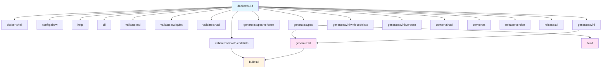

# Validation Checklist

Quick validation guide to verify all components work correctly.

## Prerequisites

- Docker installed and running
- Node.js 18+ installed

---

## Tests

### Docker Build

```bash
npm run docker:build
```

**Expected result**: Image `bri-ontology-tooling:latest` created (~5-10 min first time) in Docker

### Docker Shell

```bash
npm run docker:shell
```

**Expected result**: Interactive access to the Docker container

### Configuration

```bash
npm run config:show
```

**Expected result**: Shows versions (ontology_version: v0.1, shapes_version: v0.1, codelists_version: v0.1, build_version: v0.1) in the console

### CLI Help

```bash
npm run help
```

**Expected result**: Shows ontology-cli usage with validate/generate/convert subcommands in the console

### CLI Direct

```bash
# Direct call (recommended for complex commands with flags):
node docker/docker.js run cli validate shacl -d examples/v0.1/digital-waste-passport-sample.ttl -s shapes/v0.1/digitalWastePassportShapes.ttl

# Via npm (Windows PowerShell limitation: flags after -- are consumed):
npm run cli -- validate shacl examples/v0.1/digital-waste-passport-sample.ttl shapes/v0.1/digitalWastePassportShapes.ttl
```

**Expected result**: Runs custom CLI command inside the container
**Note**: On Windows PowerShell, use `node docker/docker.js run cli` directly for commands with flags (`-d`, `-s`, etc.)

### OWL Validation

```bash
npm run validate:owl
```

**Expected result**: Validates TTL ontologies with ROBOT, report in the console

```bash
npm run validate:owl:quiet
```

**Expected result**: Validates ontologies without verbose output, only errors in the console

```bash
npm run validate:owl:with-codelists
```

**Expected result**: Validates 9 files (ontology/v0.1/ + codelists/v0.1/), possible merge warnings in the console

### SHACL Validation

```bash
# List all available validation scenarios
npm run validate:shacl:list

# Run all scenarios (configured in config.yml)
npm run validate:shacl

# Run specific scenario by name
node docker/docker.js run cli validate shacl dwp
node docker/docker.js run cli validate shacl dmwp

# Override scenario values
node docker/docker.js run cli validate shacl dwp -d custom-data.ttl

# Custom files without scenario
node docker/docker.js run cli validate shacl \
  -d examples/v0.1/digital-waste-passport-sample.ttl \
  -s shapes/v0.1/digitalWastePassportShapes.ttl \
  -f human
```

**Expected result**: Validation report (conforms: true/false) in the console

**Configuration**: All scenarios are defined in `config.yml` under `validation.shacl.scenarios`. Add new scenarios there without modifying code.

### Generate TypeScript

```bash
npm run generate:types
```

**Expected result**: Creates `digitalWastePassport.ts` and `digitalMarpolWastePassport.ts` in `build/v0.1/`

```bash
npm run generate:types:verbose
```

**Expected result**: Same but with detailed output in the console

### Generate Wiki

```bash
npm run generate:wiki
```

**Expected result**: Creates markdown documentation in `docs/wiki/` (classes, properties, diagrams)

```bash
npm run generate:wiki:with-codelists
```

**Expected result**: Wiki with codelists documentation in `docs/wiki/`

```bash
npm run generate:wiki:verbose
```

**Expected result**: Wiki with detailed output in the console

### Generate All

```bash
npm run generate:all
```

**Expected result**: Runs generate:types + generate:wiki, outputs to `build/v0.1/` and `docs/wiki/`

### Convert SHACL to JSON Schema

```bash
npm run convert:shacl -- <shapes.ttl> <output.schema.json>
# Example:
npm run convert:shacl -- shapes/v0.1/digitalWastePassportShapes.ttl build/v0.1/digitalWastePassport.schema.json
```

**Expected result**: Creates JSON Schema at the specified path

### Convert JSON Schema to TypeScript

```bash
npm run convert:ts -- <input.schema.json> <output.ts>
# Example:
npm run convert:ts -- build/v0.1/digitalWastePassport.schema.json build/v0.1/digitalWastePassport.ts
```

**Expected result**: Creates TypeScript definitions at the specified path

### Build

```bash
npm run build
```

**Expected result**: Runs generate:types, outputs to `build/v0.1/`

### Build All

```bash
npm run build:all
```

**Expected result**: Validates OWL + generates all artifacts, outputs to `build/v0.1/` and `docs/wiki/`

### Release Version

```bash
npm run release:version -- <args>
# Example:
npm run release:version -- --help
npm run release:version -- --version v0.2
```

**Expected result**: Runs release script with specified arguments

### Release All

```bash
npm run release:all
```

**Expected result**: Executes full release pipeline

---

## Features

- **Docker Build**: Builds Docker image with all dependencies
- **Docker Shell**: Interactive access to the container for debugging
- **Configuration Management**: Shows and manages versions of all components
- **CLI Access**: Direct access to the Python CLI inside the container
- **OWL Validation**: Validates ontologies with ROBOT (quiet mode, with codelists)
- **SHACL Validation**: Validates data against SHACL shapes
- **TypeScript Generation**: Generates TypeScript types from SHACL shapes
- **Wiki Generation**: Generates markdown documentation (with/without codelists, verbose)
- **SHACL to JSON Schema**: Converts SHACL shapes to JSON Schema
- **JSON Schema to TypeScript**: Converts JSON Schema to TypeScript
- **Build Pipeline**: Generates artifacts (shortcut and full pipeline)
- **Release Management**: Manages versions and releases

---

## Command Dependencies



---

## Troubleshooting

### Docker build fails

- Ensure Docker is running: `docker ps`
- Check internet connection
- Try: `docker system prune` then `npm run docker:build`
- Check disk space: `docker system df`

### Docker commands fail

- Ensure Docker daemon is running
- Rebuild image: `npm run docker:build`
- Check Docker logs: `docker logs <container-id>`

### Config not loading

- Check `config.yml` exists in workspace root
- Try: `npm run config:show`
- Verify file permissions

### Outputs not appearing

- Check Docker volumes are mounted correctly
- Verify `build/` directory exists and is writable
- Try removing and rebuilding: `rm -rf build && npm run generate:types`

---

## Success Criteria

✅ **All validations pass when:**

- Docker image builds successfully (~5-10 min first time)
- Config shows correct versions (v0.1, v1, 0.1)
- TypeScript files generate in `build/v0.1/` via Docker
- OWL validation finds 9 versioned files
- SHACL validation runs on examples with parameters
- Wiki generation creates markdown files in `docs/wiki/`
- All commands run in Docker automatically
- Files appear in local folders (volume mounted)
