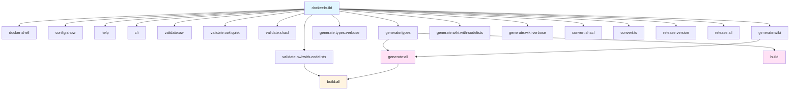

# Validation Checklist

Quick validation guide to verify all components work correctly.

## Prerequisites

- Docker installed and running
- Node.js 18+ installed

---

## Tests

### Docker Build

```bash
npm run docker:build
```

**Resultat esperat**: Image `bri-ontology-tooling:latest` creada (~5-10 min primera vegada) a Docker

### Docker Shell

```bash
npm run docker:shell
```

**Resultat esperat**: Accés interactiu al contenidor Docker

### Configuration

```bash
npm run config:show
```

**Resultat esperat**: Mostra versions (ontology_version: v0.1, shapes_version: v0.1, codelists_version: v1, contexts_version: 0.1, build_version: v0.1) a la consola

### CLI Help

```bash
npm run help
```

**Resultat esperat**: Mostra usage del ontology-cli amb subcomandes validate/generate/convert a la consola

### CLI Direct

```bash
# Direct call (recommended for complex commands with flags):
node docker/docker.js run cli validate shacl -d examples/v0.1/digital-waste-passport-sample.ttl -s shapes/v0.1/digitalWastePassportShapes.ttl

# Via npm (Windows PowerShell limitation: flags after -- are consumed):
npm run cli -- validate shacl examples/v0.1/digital-waste-passport-sample.ttl shapes/v0.1/digitalWastePassportShapes.ttl
```

**Resultat esperat**: Executa comanda CLI personalitzada dins del contenidor
**Nota**: A Windows PowerShell, utilitzar `node docker/docker.js run cli` directament per comandes amb flags (`-d`, `-s`, etc.)

### OWL Validation

```bash
npm run validate:owl
```

**Resultat esperat**: Valida ontologies TTL amb ROBOT, report a la consola

```bash
npm run validate:owl:quiet
```

**Resultat esperat**: Valida ontologies sense output verbós, només errors a la consola

```bash
npm run validate:owl:with-codelists
```

**Resultat esperat**: Valida 9 fitxers (ontology/v0.1/ + codelists/v0.1/), possibles warnings de merge a la consola

### SHACL Validation

```bash
# List all available validation scenarios
npm run validate:shacl:list

# Run all scenarios (configured in config.yml)
npm run validate:shacl

# Run specific scenario by name
node docker/docker.js run cli validate shacl dwp
node docker/docker.js run cli validate shacl dmwp

# Override scenario values
node docker/docker.js run cli validate shacl dwp -d custom-data.ttl

# Custom files without scenario
node docker/docker.js run cli validate shacl \
  -d examples/v0.1/digital-waste-passport-sample.ttl \
  -s shapes/v0.1/digitalWastePassportShapes.ttl \
  -f human
```

**Resultat esperat**: Report de validació (conforms: true/false) a la consola

**Configuration**: All scenarios are defined in `config.yml` under `validation.shacl.scenarios`. Add new scenarios there without modifying code.

### Generate TypeScript

```bash
npm run generate:types
```

**Resultat esperat**: Crea `digitalWastePassport.ts` i `digitalMarpolWastePassport.ts` a `build/v0.1/`

```bash
npm run generate:types:verbose
```

**Resultat esperat**: Igual però amb output detallat a la consola

### Generate Wiki

```bash
npm run generate:wiki
```

**Resultat esperat**: Crea documentació markdown a `docs/wiki/` (classes, propietats, diagrames)

```bash
npm run generate:wiki:with-codelists
```

**Resultat esperat**: Wiki amb documentació de codelists a `docs/wiki/`

```bash
npm run generate:wiki:verbose
```

**Resultat esperat**: Wiki amb output detallat a la consola

### Generate All

```bash
npm run generate:all
```

**Resultat esperat**: Executa generate:types + generate:wiki, outputs a `build/v0.1/` i `docs/wiki/`

### Convert SHACL to JSON Schema

```bash
npm run convert:shacl -- <shapes.ttl> <output.schema.json>
# Exemple:
npm run convert:shacl -- shapes/v0.1/digitalWastePassportShapes.ttl build/v0.1/digitalWastePassport.schema.json
```

**Resultat esperat**: Crea JSON Schema a la ruta especificada

### Convert JSON Schema to TypeScript

```bash
npm run convert:ts -- <input.schema.json> <output.ts>
# Exemple:
npm run convert:ts -- build/v0.1/digitalWastePassport.schema.json build/v0.1/digitalWastePassport.ts
```

**Resultat esperat**: Crea TypeScript definitions a la ruta especificada

### Build

```bash
npm run build
```

**Resultat esperat**: Executa generate:types, outputs a `build/v0.1/`

### Build All

```bash
npm run build:all
```

**Resultat esperat**: Valida OWL + genera tots els artifacts, outputs a `build/v0.1/` i `docs/wiki/`

### Release Version

```bash
npm run release:version -- <args>
# Exemple:
npm run release:version -- --help
npm run release:version -- --version v0.2
```

**Resultat esperat**: Executa script de release amb arguments especificats

### Release All

```bash
npm run release:all
```

**Resultat esperat**: Executa pipeline complet de release

---

## Features

- **Docker Build**: Construeix imatge Docker amb totes les dependencies
- **Docker Shell**: Accés interactiu al contenidor per debugging
- **Configuration Management**: Mostra i gestiona versions de tots els components
- **CLI Access**: Accés directe a la CLI Python dins del contenidor
- **OWL Validation**: Valida ontologies amb ROBOT (quiet mode, amb codelists)
- **SHACL Validation**: Valida dades contra shapes SHACL
- **TypeScript Generation**: Genera TypeScript types des de SHACL shapes
- **Wiki Generation**: Genera documentació markdown (amb/sense codelists, verbose)
- **SHACL to JSON Schema**: Converteix SHACL shapes a JSON Schema
- **JSON Schema to TypeScript**: Converteix JSON Schema a TypeScript
- **Build Pipeline**: Genera artifacts (shortcut i pipeline completa)
- **Release Management**: Gestiona versions i releases

---

## Command Dependencies



---

## Troubleshooting

### Docker build fails

- Ensure Docker is running: `docker ps`
- Check internet connection
- Try: `docker system prune` then `npm run docker:build`
- Check disk space: `docker system df`

### Docker commands fail

- Ensure Docker daemon is running
- Rebuild image: `npm run docker:build`
- Check Docker logs: `docker logs <container-id>`

### Config not loading

- Check `config.yml` exists in workspace root
- Try: `npm run config:show`
- Verify file permissions

### Outputs not appearing

- Check Docker volumes are mounted correctly
- Verify `build/` directory exists and is writable
- Try removing and rebuilding: `rm -rf build && npm run generate:types`

---

## Success Criteria

✅ **All validations pass when:**

- Docker image builds successfully (~5-10 min first time)
- Config shows correct versions (v0.1, v1, 0.1)
- TypeScript files generate in `build/v0.1/` via Docker
- OWL validation finds 9 versioned files
- SHACL validation runs on examples with parameters
- Wiki generation creates markdown files in `docs/wiki/`
- All commands run in Docker automatically
- Files appear in local folders (volume mounted)
