# bim-bcf copy Ontology

- **Version:** 0.1
- **Link to ontology:** [ontology/v0.1/bim-bcf copy.ttl](https://blue-room-innovation.github.io/bri-ontology/ontology/v0.1/bim-bcf%20copy.ttl)

```mermaid
classDiagram
   class bcfModel{
   }
   class bimSnippet{
       referenceSchema string
   }
   class bitmap{
       format string
       height double
   }
   class bitmaps{
   }
   class clippingPlane{
   }
   class clippingPlanes{
   }
   class colorComponents{
   }
   class coloringEntry{
       colorValue string
   }
   class comment{
       author string
       commentText string
   }
   class commentViewpointRef{
   }
   class comments{
   }
   class component{
       authoringToolId string
       ifcGuid string
       originatingSystem string
   }
   class componentColoring{
   }
   class componentSelection{
   }
   class componentVisibility{
       defaultVisibility boolean
   }
   class components{
   }
   class direction{
   }
   class document{
   }
   class documentInfo{
   }
   class documentReference{
       documentGuid string
       url string
   }
   class documentReferences{
   }
   class documentsContainer{
   }
   class exceptions{
   }
   class extensions{
   }
   class file{
       ifcProject string
       ifcSpatialStructureElement string
   }
   class filesContainer{
   }
   class header{
   }
   class labels{
       label string
   }
   class line{
   }
   class lines{
   }
   class markup{
   }
   class orthogonalCamera{
       viewToWorldScale double
   }
   class perspectiveCamera{
       fieldOfView double
   }
   class point{
   }
   class priorities{
   }
   class project{
       name string
       projectId string
   }
   class projectInfo{
   }
   class referenceLinks{
       referenceLink string
   }
   class relatedTopicRef{
   }
   class relatedTopics{
   }
   class snippetTypes{
   }
   class stages{
   }
   class topic{
       assignedTo string
       creationAuthor string
       creationDate dateTime
       dueDate dateTime
       serverAssignedId string
       title string
   }
   class topicLabels{
       topicLabel string
   }
   class topicStatuses{
   }
   class topicTypes{
   }
   class users{
       user string
   }
   class version{
       versionId string
   }
   class viewPoint{
       snapshot string
       viewpointFile string
   }
   class viewSetupHints{
       openingsVisible boolean
       spaceBoundariesVisible boolean
       spacesVisible boolean
   }
   class viewpoints{
   }
   class visualizationInfo{
   }
   class n528d39ce95614b6290e1532610d0bb8db1{
   }
   class n528d39ce95614b6290e1532610d0bb8db10{
   }
   class n528d39ce95614b6290e1532610d0bb8db13{
   }
   class n528d39ce95614b6290e1532610d0bb8db16{
   }
   class n528d39ce95614b6290e1532610d0bb8db20{
   }
   class n528d39ce95614b6290e1532610d0bb8db23{
       filename string
   }
   class n528d39ce95614b6290e1532610d0bb8db26{
       description string
   }
   class n528d39ce95614b6290e1532610d0bb8db30{
       topicType string
   }
   class n528d39ce95614b6290e1532610d0bb8db33{
       topicStatus string
   }
   class n528d39ce95614b6290e1532610d0bb8db36{
       priority string
   }
   class n528d39ce95614b6290e1532610d0bb8db39{
       snippetType string
   }
   class n528d39ce95614b6290e1532610d0bb8db4{
   }
   class n528d39ce95614b6290e1532610d0bb8db42{
       stage string
   }
   class n528d39ce95614b6290e1532610d0bb8db45{
       index int
   }
   class n528d39ce95614b6290e1532610d0bb8db48{
       modifiedDate dateTime
   }
   class n528d39ce95614b6290e1532610d0bb8db51{
       modifiedAuthor string
   }
   class n528d39ce95614b6290e1532610d0bb8db54{
       reference string
   }
   class n528d39ce95614b6290e1532610d0bb8db58{
       isExternal boolean
   }
   class n528d39ce95614b6290e1532610d0bb8db61{
       date dateTime
   }
   class n528d39ce95614b6290e1532610d0bb8db64{
       aspectRatio double
   }
   class n528d39ce95614b6290e1532610d0bb8db67{
       x double
   }
   class n528d39ce95614b6290e1532610d0bb8db7{
   }
   class n528d39ce95614b6290e1532610d0bb8db70{
       y double
   }
   class n528d39ce95614b6290e1532610d0bb8db73{
       z double
   }
   topic --> bimSnippet : bimSnippet
   bitmaps --> bitmap : bitmap
   visualizationInfo --> bitmaps : bitmaps
   n528d39ce95614b6290e1532610d0bb8db10 --> direction : cameraDirection
   n528d39ce95614b6290e1532610d0bb8db13 --> direction : cameraUpVector
   n528d39ce95614b6290e1532610d0bb8db7 --> point : cameraViewPoint
   clippingPlanes --> clippingPlane : clippingPlane
   visualizationInfo --> clippingPlanes : clippingPlanes
   componentColoring --> coloringEntry : color
   components --> componentColoring : coloring
   comments --> comment : comment
   topic --> comments : comments
   n528d39ce95614b6290e1532610d0bb8db16 --> component : component
   n528d39ce95614b6290e1532610d0bb8db1 --> n528d39ce95614b6290e1532610d0bb8db4 : components
   clippingPlane --> direction : direction
   documentsContainer --> document : document
   bcfModel --> documentInfo : documentInfo
   documentReferences --> documentReference : documentReference
   topic --> documentReferences : documentReferences
   documentInfo --> documentsContainer : documents
   line --> point : endPoint
   componentVisibility --> exceptions : exceptions
   bcfModel --> extensions : extensions
   filesContainer --> file : file
   header --> filesContainer : files
   markup --> header : header
   topic --> labels : labels
   lines --> line : line
   visualizationInfo --> lines : lines
   n528d39ce95614b6290e1532610d0bb8db20 --> point : location
   bcfModel --> markup : markup
   bitmap --> direction : normal
   visualizationInfo --> orthogonalCamera : orthogonalCamera
   visualizationInfo --> perspectiveCamera : perspectiveCamera
   extensions --> priorities : priorities
   projectInfo --> project : project
   bcfModel --> projectInfo : projectInfo
   topic --> referenceLinks : referenceLinks
   relatedTopics --> relatedTopicRef : relatedTopic
   topic --> relatedTopics : relatedTopics
   components --> componentSelection : selection
   extensions --> snippetTypes : snippetTypes
   extensions --> stages : stages
   line --> point : startPoint
   markup --> topic : topic
   extensions --> topicLabels : topicLabels
   extensions --> topicStatuses : topicStatuses
   extensions --> topicTypes : topicTypes
   bitmap --> direction : up
   extensions --> users : users
   bcfModel --> version : version
   viewpoints --> viewPoint : viewPoint
   componentVisibility --> viewSetupHints : viewSetupHints
   comment --> commentViewpointRef : viewpoint
   topic --> viewpoints : viewpoints
   components --> componentVisibility : visibility
   bcfModel --> visualizationInfo : visualizationInfo
```

## Classes

|Name|Description|Datatype properties|Object properties|Subclass of|
| :--- | :--- | :--- | :--- | :--- |
|bcfModel|Root container class for BIM BCF model resources.||[documentInfo](#documentInfo), [extensions](#extensions), [markup](#markup), [projectInfo](#projectInfo), [version](#version), [visualizationInfo](#visualizationInfo)||
|bimSnippet|BIM snippet metadata containing reference and schema details.|[referenceSchema](#referenceSchema)|||
|bitmap|Bitmap overlay with placement, orientation, format, and size.|[format](#format), [height](#height)|[normal](#normal), [up](#up)||
|bitmaps|Collection class for bitmap overlays.||[bitmap](#bitmap)||
|clippingPlane|Clipping plane defined by location and direction.||[direction](#direction)||
|clippingPlanes|Collection class for clipping planes.||[clippingPlane](#clippingPlane)||
|colorComponents|Set of components affected by a single color rule.||||
|coloringEntry|Single color rule entry linking components and a color value.|[colorValue](#colorValue)|||
|comment|Comment resource with authoring and modification metadata.|[author](#author), [commentText](#commentText)|[viewpoint](#viewpoint)||
|commentViewpointRef|Reference from comment to a viewpoint identified by GUID.||||
|comments|Collection class for comment entries.||[comment](#comment)||
|component|IFC component reference with optional originating system metadata.|[authoringToolId](#authoringToolId), [ifcGuid](#ifcGuid), [originatingSystem](#originatingSystem)|||
|componentColoring|Collection of component coloring entries.||[color](#color)||
|componentSelection|Collection of selected components.||||
|componentVisibility|Default visibility and exception settings for components.|[defaultVisibility](#defaultVisibility)|[exceptions](#exceptions), [viewSetupHints](#viewSetupHints)||
|components|Components definition containing selection, visibility, and coloring sections.||[coloring](#coloring), [selection](#selection), [visibility](#visibility)||
|direction|3D direction vector represented by X, Y, and Z components.||||
|document|Document metadata entry with filename, description, and GUID.||||
|documentInfo|Container class for document metadata.||[documents](#documents)||
|documentReference|Document reference class for either internal document GUID or external URL.|[documentGuid](#documentGuid), [url](#url)|||
|documentReferences|Collection class for document references.||[documentReference](#documentReference)||
|documentsContainer|Collection class that groups document entries.||[document](#document)||
|exceptions|Visibility exception list for components.||||
|extensions|Container class for extension catalogs.||[priorities](#priorities), [snippetTypes](#snippetTypes), [stages](#stages), [topicLabels](#topicLabels), [topicStatuses](#topicStatuses), [topicTypes](#topicTypes), [users](#users)||
|file|Referenced file metadata class in the markup header.|[ifcProject](#ifcProject), [ifcSpatialStructureElement](#ifcSpatialStructureElement)|||
|filesContainer|Collection class for file entries.||[file](#file)||
|header|Header section containing referenced files.||[files](#files)||
|labels|Collection class for topic labels.|[label](#label)|||
|line|Line overlay defined by start and end points.||[endPoint](#endPoint), [startPoint](#startPoint)||
|lines|Collection class for line overlays.||[line](#line)||
|markup|Main BCF markup class containing header and topic.||[header](#header), [topic](#topic)||
|orthogonalCamera|Orthogonal camera definition.|[viewToWorldScale](#viewToWorldScale)|||
|perspectiveCamera|Perspective camera definition.|[fieldOfView](#fieldOfView)|||
|point|3D point represented by X, Y, and Z coordinates.||||
|priorities|Collection of priority literals.||||
|project|Project details with project ID and optional name.|[name](#name), [projectId](#projectId)|||
|projectInfo|Project information wrapper.||[project](#project)||
|referenceLinks|Collection class for topic reference links.|[referenceLink](#referenceLink)|||
|relatedTopicRef|Reference class identifying a related topic by GUID.||||
|relatedTopics|Collection class for links to related topics.||[relatedTopic](#relatedTopic)||
|snippetTypes|Collection of BIM snippet type literals.||||
|stages|Collection of stage literals.||||
|topic|Core issue/topic class with metadata, workflow state, comments, and viewpoints.|[assignedTo](#assignedTo), [creationAuthor](#creationAuthor), [creationDate](#creationDate), [dueDate](#dueDate), [serverAssignedId](#serverAssignedId), [title](#title)|[bimSnippet](#bimSnippet), [comments](#comments), [documentReferences](#documentReferences), [labels](#labels), [referenceLinks](#referenceLinks), [relatedTopics](#relatedTopics), [viewpoints](#viewpoints)||
|topicLabels|Collection of topic label literals.|[topicLabel](#topicLabel)|||
|topicStatuses|Collection of topic status literals.||||
|topicTypes|Collection of topic type literals.||||
|users|Collection of user identifier literals.|[user](#user)|||
|version|Version payload with required version identifier.|[versionId](#versionId)|||
|viewPoint|Viewpoint resource with viewpoint file, snapshot, index, and GUID.|[snapshot](#snapshot), [viewpointFile](#viewpointFile)|||
|viewSetupHints|Viewer hints for visibility of spaces, boundaries, and openings.|[openingsVisible](#openingsVisible), [spaceBoundariesVisible](#spaceBoundariesVisible), [spacesVisible](#spacesVisible)|||
|viewpoints|Collection class for viewpoint entries.||[viewPoint](#viewPoint)||
|visualizationInfo|Visualization payload including camera configuration and overlays.||[bitmaps](#bitmaps), [clippingPlanes](#clippingPlanes), [lines](#lines), [orthogonalCamera](#orthogonalCamera), [perspectiveCamera](#perspectiveCamera)||
|n528d39ce95614b6290e1532610d0bb8db1|||[components](#components)||
|n528d39ce95614b6290e1532610d0bb8db10|||[cameraDirection](#cameraDirection)||
|n528d39ce95614b6290e1532610d0bb8db13|||[cameraUpVector](#cameraUpVector)||
|n528d39ce95614b6290e1532610d0bb8db16|||[component](#component)||
|n528d39ce95614b6290e1532610d0bb8db20|||[location](#location)||
|n528d39ce95614b6290e1532610d0bb8db23||[filename](#filename)|||
|n528d39ce95614b6290e1532610d0bb8db26||[description](#description)|||
|n528d39ce95614b6290e1532610d0bb8db30||[topicType](#topicType)|||
|n528d39ce95614b6290e1532610d0bb8db33||[topicStatus](#topicStatus)|||
|n528d39ce95614b6290e1532610d0bb8db36||[priority](#priority)|||
|n528d39ce95614b6290e1532610d0bb8db39||[snippetType](#snippetType)|||
|n528d39ce95614b6290e1532610d0bb8db4|||||
|n528d39ce95614b6290e1532610d0bb8db42||[stage](#stage)|||
|n528d39ce95614b6290e1532610d0bb8db45||[index](#index)|||
|n528d39ce95614b6290e1532610d0bb8db48||[modifiedDate](#modifiedDate)|||
|n528d39ce95614b6290e1532610d0bb8db51||[modifiedAuthor](#modifiedAuthor)|||
|n528d39ce95614b6290e1532610d0bb8db54||[reference](#reference)|||
|n528d39ce95614b6290e1532610d0bb8db58||[isExternal](#isExternal)|||
|n528d39ce95614b6290e1532610d0bb8db61||[date](#date)|||
|n528d39ce95614b6290e1532610d0bb8db64||[aspectRatio](#aspectRatio)|||
|n528d39ce95614b6290e1532610d0bb8db67||[x](#x)|||
|n528d39ce95614b6290e1532610d0bb8db7|||[cameraViewPoint](#cameraViewPoint)||
|n528d39ce95614b6290e1532610d0bb8db70||[y](#y)|||
|n528d39ce95614b6290e1532610d0bb8db73||[z](#z)|||

## Data Properties

|Name|Description|Domain|Range|Subproperty of|
| :--- | :--- | :--- | :--- | :--- |
|aspectRatio|Width/height aspect ratio of the camera view.|[n528d39ce95614b6290e1532610d0bb8db64](#n528d39ce95614b6290e1532610d0bb8db64)|double||
|assignedTo|Assignee identifier for the topic.|[topic](#topic)|string||
|author|Author identifier for a comment entry.|[comment](#comment)|string|author|
|authoringToolId|Identifier of the component in the authoring tool.|[component](#component)|string|identifier, identifier|
|colorValue|Hexadecimal RGB or RGBA color value used in a coloring rule.|[coloringEntry](#coloringEntry)|string||
|commentText|Textual body of a comment entry.|[comment](#comment)|string|text|
|creationAuthor|Author who created the topic.|[topic](#topic)|string|creator, author|
|creationDate|Timestamp when the topic was created.|[topic](#topic)|dateTime|dateCreated, created|
|date|Timestamp associated with a file or comment entry.|[n528d39ce95614b6290e1532610d0bb8db61](#n528d39ce95614b6290e1532610d0bb8db61)|dateTime||
|defaultVisibility|Default visibility state for components in a viewpoint.|[componentVisibility](#componentVisibility)|boolean||
|description|Human-readable description text.|[n528d39ce95614b6290e1532610d0bb8db26](#n528d39ce95614b6290e1532610d0bb8db26)|string|description, description|
|documentGuid|GUID of an internal document referenced by a topic.|[documentReference](#documentReference)|string|identifier, identifier|
|dueDate|Requested due date for the topic.|[topic](#topic)|dateTime||
|fieldOfView|Vertical field of view angle in degrees for perspective camera.|[perspectiveCamera](#perspectiveCamera)|double||
|filename|Filename associated with a document or file entry.|[n528d39ce95614b6290e1532610d0bb8db23](#n528d39ce95614b6290e1532610d0bb8db23)|string|name|
|format|Bitmap image format (for example, png or jpg).|[bitmap](#bitmap)|string|fileFormat, format|
|guid|Globally unique identifier represented as text.|[Thing](#Thing)|string|identifier, identifier|
|height|Height of the bitmap overlay in world units.|[bitmap](#bitmap)|double|height|
|ifcGuid|IFC GUID of the component.|[component](#component)|string|identifier, identifier|
|ifcProject|IFC project GUID associated with a file entry.|[file](#file)|string|identifier, identifier|
|ifcSpatialStructureElement|IFC spatial structure element GUID associated with a file entry.|[file](#file)|string|identifier, identifier|
|index|Integer sort/index value for topic or viewpoint.|[n528d39ce95614b6290e1532610d0bb8db45](#n528d39ce95614b6290e1532610d0bb8db45)|int|position|
|isExternal|Indicates whether a referenced resource is external to the BCF package.|[n528d39ce95614b6290e1532610d0bb8db58](#n528d39ce95614b6290e1532610d0bb8db58)|boolean||
|label|Single label attached to a topic.|[labels](#labels)|string|keywords, subject|
|modifiedAuthor|Author of the latest modification.|[n528d39ce95614b6290e1532610d0bb8db51](#n528d39ce95614b6290e1532610d0bb8db51)|string|author|
|modifiedDate|Timestamp of the latest modification.|[n528d39ce95614b6290e1532610d0bb8db48](#n528d39ce95614b6290e1532610d0bb8db48)|dateTime|dateModified, modified|
|name|Human-readable name of the project.|[project](#project)|string|name|
|openingsVisible|Viewer hint indicating whether openings are visible.|[viewSetupHints](#viewSetupHints)|boolean||
|originatingSystem|Name of the source system for a component reference.|[component](#component)|string||
|priority|Priority value or catalog entry.|[n528d39ce95614b6290e1532610d0bb8db36](#n528d39ce95614b6290e1532610d0bb8db36)|string||
|projectId|Identifier for the project.|[project](#project)|string|identifier, identifier|
|reference|Reference string (filename, URI, or path) used by snippets, files, and bitmaps.|[n528d39ce95614b6290e1532610d0bb8db54](#n528d39ce95614b6290e1532610d0bb8db54)|string|contentUrl|
|referenceLink|External reference URL associated with a topic.|[referenceLinks](#referenceLinks)|string|url, references|
|referenceSchema|Schema identifier associated with a BIM snippet.|[bimSnippet](#bimSnippet)|string||
|serverAssignedId|Server-assigned topic identifier.|[topic](#topic)|string|identifier, identifier|
|snapshot|Snapshot image filename associated with a viewpoint.|[viewPoint](#viewPoint)|string|image, contentUrl|
|snippetType|Snippet type value used in topic snippets and extension catalogs.|[n528d39ce95614b6290e1532610d0bb8db39](#n528d39ce95614b6290e1532610d0bb8db39)|string|type|
|spaceBoundariesVisible|Viewer hint indicating whether space boundaries are visible.|[viewSetupHints](#viewSetupHints)|boolean||
|spacesVisible|Viewer hint indicating whether spaces are visible.|[viewSetupHints](#viewSetupHints)|boolean||
|stage|Stage value used in topics and extension catalogs.|[n528d39ce95614b6290e1532610d0bb8db42](#n528d39ce95614b6290e1532610d0bb8db42)|string||
|title|Short human-readable title of a topic.|[topic](#topic)|string|name, title|
|topicLabel|Single label value available in extension catalogs.|[topicLabels](#topicLabels)|string|keywords, subject|
|topicStatus|Topic status value or catalog entry.|[n528d39ce95614b6290e1532610d0bb8db33](#n528d39ce95614b6290e1532610d0bb8db33)|string||
|topicType|Topic type value or catalog entry.|[n528d39ce95614b6290e1532610d0bb8db30](#n528d39ce95614b6290e1532610d0bb8db30)|string|type|
|url|URL of an external document referenced by a topic.|[documentReference](#documentReference)|string|url, references|
|user|Single user value available in extension catalogs.|[users](#users)|string||
|versionId|Version identifier string for BCF payload.|[version](#version)|string|identifier, identifier|
|viewToWorldScale|Visible vertical size in world units for orthogonal camera.|[orthogonalCamera](#orthogonalCamera)|double||
|viewpointFile|Filename or path of the viewpoint file associated with a viewpoint resource.|[viewPoint](#viewPoint)|string|contentUrl|
|x|X coordinate component.|[n528d39ce95614b6290e1532610d0bb8db67](#n528d39ce95614b6290e1532610d0bb8db67)|double||
|y|Y coordinate component.|[n528d39ce95614b6290e1532610d0bb8db70](#n528d39ce95614b6290e1532610d0bb8db70)|double||
|z|Z coordinate component.|[n528d39ce95614b6290e1532610d0bb8db73](#n528d39ce95614b6290e1532610d0bb8db73)|double||

## Object Properties

|Name|Descriptions|Domain|Range|Subproperty of|
| :--- | :--- | :--- | :--- | :--- |
|bimSnippet|BIM snippet metadata containing reference and schema details. Links topic to its BIM snippet description.|[topic](#topic)|[bimSnippet](#bimSnippet)||
|bitmap|Bitmap overlay with placement, orientation, format, and size. References individual bitmap overlay entries.|[bitmaps](#bitmaps)|[bitmap](#bitmap)||
|bitmaps|Collection class for bitmap overlays. Associates visualization info with bitmap overlays.|[visualizationInfo](#visualizationInfo)|[bitmaps](#bitmaps)||
|cameraDirection|Camera forward direction vector.|[n528d39ce95614b6290e1532610d0bb8db10](#n528d39ce95614b6290e1532610d0bb8db10)|[direction](#direction)||
|cameraUpVector|Camera up direction vector.|[n528d39ce95614b6290e1532610d0bb8db13](#n528d39ce95614b6290e1532610d0bb8db13)|[direction](#direction)||
|cameraViewPoint|Camera position in 3D space.|[n528d39ce95614b6290e1532610d0bb8db7](#n528d39ce95614b6290e1532610d0bb8db7)|[point](#point)||
|clippingPlane|Clipping plane defined by location and direction. References individual clipping plane entries.|[clippingPlanes](#clippingPlanes)|[clippingPlane](#clippingPlane)||
|clippingPlanes|Collection class for clipping planes. Associates visualization info with clipping plane definitions.|[visualizationInfo](#visualizationInfo)|[clippingPlanes](#clippingPlanes)||
|color|Links component coloring container to individual coloring entries.|[componentColoring](#componentColoring)|[coloringEntry](#coloringEntry)||
|coloring|Color overrides for components within a viewpoint.|[components](#components)|[componentColoring](#componentColoring)||
|comment|Comment resource with authoring and modification metadata. Links comments container to individual comment entries.|[comments](#comments)|[comment](#comment)||
|comments|Collection class for comment entries. Links topic to its comment collection.|[topic](#topic)|[comments](#comments)||
|component|IFC component reference with optional originating system metadata. References individual IFC components.|[n528d39ce95614b6290e1532610d0bb8db16](#n528d39ce95614b6290e1532610d0bb8db16)|[component](#component)||
|components|Components definition containing selection, visibility, and coloring sections. References component sets used in visualization and coloring entries.|[n528d39ce95614b6290e1532610d0bb8db1](#n528d39ce95614b6290e1532610d0bb8db1)|[n528d39ce95614b6290e1532610d0bb8db4](#n528d39ce95614b6290e1532610d0bb8db4)||
|direction|3D direction vector represented by X, Y, and Z components. Normal direction of a clipping plane.|[clippingPlane](#clippingPlane)|[direction](#direction)||
|document|Document metadata entry with filename, description, and GUID. Links a documents collection to individual document metadata entries.|[documentsContainer](#documentsContainer)|[document](#document)||
|documentInfo|Container class for document metadata. Links a BCF model to its document information section.|[bcfModel](#bcfModel)|[documentInfo](#documentInfo)||
|documentReference|Document reference class for either internal document GUID or external URL. Links document references container to individual reference entries.|[documentReferences](#documentReferences)|[documentReference](#documentReference)||
|documentReferences|Collection class for document references. Links topic to document reference entries.|[topic](#topic)|[documentReferences](#documentReferences)||
|documents|Container relation that groups document entries.|[documentInfo](#documentInfo)|[documentsContainer](#documentsContainer)||
|endPoint|End point of a line segment.|[line](#line)|[point](#point)||
|exceptions|Visibility exception list for components. Components that differ from default visibility.|[componentVisibility](#componentVisibility)|[exceptions](#exceptions)||
|extensions|Container class for extension catalogs. Links a BCF model to extension vocabularies like status, type, stage, and labels.|[bcfModel](#bcfModel)|[extensions](#extensions)||
|file|Referenced file metadata class in the markup header. Links a files collection to individual file entries.|[filesContainer](#filesContainer)|[file](#file)||
|files|Container relation for header file entries.|[header](#header)|[filesContainer](#filesContainer)||
|header|Header section containing referenced files. Links markup to optional header information.|[markup](#markup)|[header](#header)||
|labels|Collection class for topic labels. Links topic to free-form labels container.|[topic](#topic)|[labels](#labels)||
|line|Line overlay defined by start and end points. References individual line overlay entries.|[lines](#lines)|[line](#line)||
|lines|Collection class for line overlays. Associates visualization info with line overlays.|[visualizationInfo](#visualizationInfo)|[lines](#lines)||
|location|3D location used by clipping planes and bitmap placement.|[n528d39ce95614b6290e1532610d0bb8db20](#n528d39ce95614b6290e1532610d0bb8db20)|[point](#point)||
|markup|Main BCF markup class containing header and topic. Links a BCF model to its main markup content.|[bcfModel](#bcfModel)|[markup](#markup)||
|normal|Normal vector of a bitmap overlay plane.|[bitmap](#bitmap)|[direction](#direction)||
|orthogonalCamera|Orthogonal camera definition. Associates visualization info with an orthogonal camera definition.|[visualizationInfo](#visualizationInfo)|[orthogonalCamera](#orthogonalCamera)||
|perspectiveCamera|Perspective camera definition. Associates visualization info with a perspective camera definition.|[visualizationInfo](#visualizationInfo)|[perspectiveCamera](#perspectiveCamera)||
|priorities|Collection of priority literals. Links extensions to the available priority values.|[extensions](#extensions)|[priorities](#priorities)||
|project|Project details with project ID and optional name. Links project info to the concrete project descriptor.|[projectInfo](#projectInfo)|[project](#project)||
|projectInfo|Project information wrapper. Links a BCF model to the project information section.|[bcfModel](#bcfModel)|[projectInfo](#projectInfo)||
|referenceLinks|Collection class for topic reference links. Links topic to external reference URLs.|[topic](#topic)|[referenceLinks](#referenceLinks)||
|relatedTopic|Links related-topics container to individual related topic references.|[relatedTopics](#relatedTopics)|[relatedTopicRef](#relatedTopicRef)||
|relatedTopics|Collection class for links to related topics. Links topic to references to other related topics.|[topic](#topic)|[relatedTopics](#relatedTopics)||
|selection|Selected components within a viewpoint.|[components](#components)|[componentSelection](#componentSelection)||
|snippetTypes|Collection of BIM snippet type literals. Links extensions to the available BIM snippet types.|[extensions](#extensions)|[snippetTypes](#snippetTypes)||
|stages|Collection of stage literals. Links extensions to the available workflow stages.|[extensions](#extensions)|[stages](#stages)||
|startPoint|Start point of a line segment.|[line](#line)|[point](#point)||
|topic|Core issue/topic class with metadata, workflow state, comments, and viewpoints. Links markup to its main topic issue payload.|[markup](#markup)|[topic](#topic)||
|topicLabels|Collection of topic label literals. Links extensions to the available topic labels.|[extensions](#extensions)|[topicLabels](#topicLabels)||
|topicStatuses|Collection of topic status literals. Links extensions to the available topic status values.|[extensions](#extensions)|[topicStatuses](#topicStatuses)||
|topicTypes|Collection of topic type literals. Links extensions to the available topic type values.|[extensions](#extensions)|[topicTypes](#topicTypes)||
|up|Up vector of a bitmap overlay plane.|[bitmap](#bitmap)|[direction](#direction)||
|users|Collection of user identifier literals. Links extensions to the available user identifiers.|[extensions](#extensions)|[users](#users)||
|version|Version payload with required version identifier. Links a BCF model to its declared version payload.|[bcfModel](#bcfModel)|[version](#version)||
|viewPoint|Viewpoint resource with viewpoint file, snapshot, index, and GUID. Links viewpoints container to individual viewpoint entries.|[viewpoints](#viewpoints)|[viewPoint](#viewPoint)||
|viewSetupHints|Viewer hints for visibility of spaces, boundaries, and openings. Viewer hints for spaces, openings, and boundaries.|[componentVisibility](#componentVisibility)|[viewSetupHints](#viewSetupHints)||
|viewpoint|Links a comment to a referenced viewpoint.|[comment](#comment)|[commentViewpointRef](#commentViewpointRef)||
|viewpoints|Collection class for viewpoint entries. Links topic to viewpoint definitions and snapshots.|[topic](#topic)|[viewpoints](#viewpoints)||
|visibility|Visibility rules for components within a viewpoint.|[components](#components)|[componentVisibility](#componentVisibility)||
|visualizationInfo|Visualization payload including camera configuration and overlays. Links a BCF model to viewpoint visualization information.|[bcfModel](#bcfModel)|[visualizationInfo](#visualizationInfo)||
