# bim-bcf Ontology

- **Version:** 0.1
- **Link to ontology:** [ontology/v0.1/bim-bcf.ttl](https://blue-room-innovation.github.io/bri-ontology/ontology/v0.1/bim-bcf.ttl)

```mermaid
classDiagram
   class bcfModel{
   }
   class bimSnippet{
       referenceSchema string
   }
   class bitmap{
       format string
       height double
   }
   class clippingPlane{
   }
   class coloringEntry{
       colorValue string
   }
   class comment{
       author string
       commentText string
   }
   class commentViewpointRef{
   }
   class component{
       authoringToolId string
       ifcGuid string
       originatingSystem string
   }
   class componentVisibility{
       defaultVisibility boolean
   }
   class components{
   }
   class direction{
   }
   class document{
   }
   class documentReference{
       documentGuid string
       url string
   }
   class extensions{
       priorities string
       snippetTypes string
       stages string
       topicLabels string
       topicStatuses string
       topicTypes string
       users string
   }
   class file{
       ifcProject string
       ifcSpatialStructureElement string
   }
   class header{
   }
   class line{
   }
   class markup{
   }
   class orthogonalCamera{
       viewToWorldScale double
   }
   class perspectiveCamera{
       fieldOfView double
   }
   class point{
   }
   class project{
       name string
       projectId string
   }
   class relatedTopicRef{
   }
   class topic{
       assignedTo string
       creationAuthor string
       creationDate dateTime
       dueDate dateTime
       labels string
       priority string
       referenceLinks string
       serverAssignedId string
       stage string
       title string
       topicStatus string
       topicType string
   }
   class version{
       versionId string
   }
   class viewPoint{
       snapshot string
       viewpointFile string
   }
   class viewSetupHints{
       openingsVisible boolean
       spaceBoundariesVisible boolean
       spacesVisible boolean
   }
   class visualizationInfo{
   }
   class n8c2bdbc85a1f44838e37b2e6c92f758db1{
   }
   class n8c2bdbc85a1f44838e37b2e6c92f758db10{
   }
   class n8c2bdbc85a1f44838e37b2e6c92f758db13{
   }
   class n8c2bdbc85a1f44838e37b2e6c92f758db16{
   }
   class n8c2bdbc85a1f44838e37b2e6c92f758db19{
       filename string
   }
   class n8c2bdbc85a1f44838e37b2e6c92f758db22{
       description string
   }
   class n8c2bdbc85a1f44838e37b2e6c92f758db26{
       index int
   }
   class n8c2bdbc85a1f44838e37b2e6c92f758db29{
       modifiedDate dateTime
   }
   class n8c2bdbc85a1f44838e37b2e6c92f758db32{
       modifiedAuthor string
   }
   class n8c2bdbc85a1f44838e37b2e6c92f758db35{
       reference string
   }
   class n8c2bdbc85a1f44838e37b2e6c92f758db39{
       isExternal boolean
   }
   class n8c2bdbc85a1f44838e37b2e6c92f758db4{
   }
   class n8c2bdbc85a1f44838e37b2e6c92f758db42{
       date dateTime
   }
   class n8c2bdbc85a1f44838e37b2e6c92f758db45{
       aspectRatio double
   }
   class n8c2bdbc85a1f44838e37b2e6c92f758db48{
       x double
   }
   class n8c2bdbc85a1f44838e37b2e6c92f758db51{
       y double
   }
   class n8c2bdbc85a1f44838e37b2e6c92f758db54{
       z double
   }
   class n8c2bdbc85a1f44838e37b2e6c92f758db7{
   }
   topic --> bimSnippet : bimSnippet
   visualizationInfo --> bitmap : bitmaps
   n8c2bdbc85a1f44838e37b2e6c92f758db10 --> direction : cameraDirection
   n8c2bdbc85a1f44838e37b2e6c92f758db13 --> direction : cameraUpVector
   n8c2bdbc85a1f44838e37b2e6c92f758db7 --> point : cameraViewPoint
   visualizationInfo --> clippingPlane : clippingPlanes
   components --> coloringEntry : coloring
   topic --> comment : comments
   n8c2bdbc85a1f44838e37b2e6c92f758db1 --> n8c2bdbc85a1f44838e37b2e6c92f758db4 : components
   clippingPlane --> direction : direction
   topic --> documentReference : documentReferences
   bcfModel --> document : documents
   line --> point : endPoint
   componentVisibility --> component : exceptions
   bcfModel --> extensions : extensions
   header --> file : files
   markup --> header : header
   visualizationInfo --> line : lines
   n8c2bdbc85a1f44838e37b2e6c92f758db16 --> point : location
   bcfModel --> markup : markup
   bitmap --> direction : normal
   visualizationInfo --> orthogonalCamera : orthogonalCamera
   visualizationInfo --> perspectiveCamera : perspectiveCamera
   bcfModel --> project : project
   topic --> relatedTopicRef : relatedTopics
   components --> component : selection
   line --> point : startPoint
   markup --> topic : topic
   bitmap --> direction : up
   bcfModel --> version : version
   componentVisibility --> viewSetupHints : viewSetupHints
   comment --> commentViewpointRef : viewpoint
   topic --> viewPoint : viewpoints
   components --> componentVisibility : visibility
   bcfModel --> visualizationInfo : visualizationInfo
```

## Classes

|Name|Description|Datatype properties|Object properties|Subclass of|
| :--- | :--- | :--- | :--- | :--- |
|bcfModel|Root container class for BIM BCF model resources.||[documents](#documents), [extensions](#extensions), [markup](#markup), [project](#project), [version](#version), [visualizationInfo](#visualizationInfo)||
|bimSnippet|BIM snippet metadata containing reference and schema details.|[referenceSchema](#referenceSchema)|||
|bitmap|Bitmap overlay with placement, orientation, format, and size.|[format](#format), [height](#height)|[normal](#normal), [up](#up)||
|clippingPlane|Clipping plane defined by location and direction.||[direction](#direction)||
|coloringEntry|Single color rule entry linking components and a color value.|[colorValue](#colorValue)|||
|comment|Comment resource with authoring and modification metadata.|[author](#author), [commentText](#commentText)|[viewpoint](#viewpoint)||
|commentViewpointRef|Reference from comment to a viewpoint identified by GUID.||||
|component|IFC component reference with optional originating system metadata.|[authoringToolId](#authoringToolId), [ifcGuid](#ifcGuid), [originatingSystem](#originatingSystem)|||
|componentVisibility|Default visibility and exception settings for components.|[defaultVisibility](#defaultVisibility)|[exceptions](#exceptions), [viewSetupHints](#viewSetupHints)||
|components|Components definition containing selection, visibility, and coloring sections.||[coloring](#coloring), [selection](#selection), [visibility](#visibility)||
|direction|3D direction vector represented by X, Y, and Z components.||||
|document|Document metadata entry with filename, description, and GUID.||||
|documentReference|Document reference class for either internal document GUID or external URL.|[documentGuid](#documentGuid), [url](#url)|||
|extensions|Extension catalog holder.|[priorities](#priorities), [snippetTypes](#snippetTypes), [stages](#stages), [topicLabels](#topicLabels), [topicStatuses](#topicStatuses), [topicTypes](#topicTypes), [users](#users)|||
|file|Referenced file metadata class in the markup header.|[ifcProject](#ifcProject), [ifcSpatialStructureElement](#ifcSpatialStructureElement)|||
|header|Header section containing referenced files.||[files](#files)||
|line|Line overlay defined by start and end points.||[endPoint](#endPoint), [startPoint](#startPoint)||
|markup|Main BCF markup class containing header and topic.||[header](#header), [topic](#topic)||
|orthogonalCamera|Orthogonal camera definition.|[viewToWorldScale](#viewToWorldScale)|||
|perspectiveCamera|Perspective camera definition.|[fieldOfView](#fieldOfView)|||
|point|3D point represented by X, Y, and Z coordinates.||||
|project|Project details with project ID and optional name.|[name](#name), [projectId](#projectId)|||
|relatedTopicRef|Reference class identifying a related topic by GUID.||||
|topic|Core issue/topic class with metadata, workflow state, comments, and viewpoints.|[assignedTo](#assignedTo), [creationAuthor](#creationAuthor), [creationDate](#creationDate), [dueDate](#dueDate), [labels](#labels), [priority](#priority), [referenceLinks](#referenceLinks), [serverAssignedId](#serverAssignedId), [stage](#stage), [title](#title), [topicStatus](#topicStatus), [topicType](#topicType)|[bimSnippet](#bimSnippet), [comments](#comments), [documentReferences](#documentReferences), [relatedTopics](#relatedTopics), [viewpoints](#viewpoints)||
|version|Version payload with required version identifier.|[versionId](#versionId)|||
|viewPoint|Viewpoint resource with viewpoint file, snapshot, index, and GUID.|[snapshot](#snapshot), [viewpointFile](#viewpointFile)|||
|viewSetupHints|Viewer hints for visibility of spaces, boundaries, and openings.|[openingsVisible](#openingsVisible), [spaceBoundariesVisible](#spaceBoundariesVisible), [spacesVisible](#spacesVisible)|||
|visualizationInfo|Visualization payload including camera configuration and overlays.||[bitmaps](#bitmaps), [clippingPlanes](#clippingPlanes), [lines](#lines), [orthogonalCamera](#orthogonalCamera), [perspectiveCamera](#perspectiveCamera)||
|n8c2bdbc85a1f44838e37b2e6c92f758db1|||[components](#components)||
|n8c2bdbc85a1f44838e37b2e6c92f758db10|||[cameraDirection](#cameraDirection)||
|n8c2bdbc85a1f44838e37b2e6c92f758db13|||[cameraUpVector](#cameraUpVector)||
|n8c2bdbc85a1f44838e37b2e6c92f758db16|||[location](#location)||
|n8c2bdbc85a1f44838e37b2e6c92f758db19||[filename](#filename)|||
|n8c2bdbc85a1f44838e37b2e6c92f758db22||[description](#description)|||
|n8c2bdbc85a1f44838e37b2e6c92f758db26||[index](#index)|||
|n8c2bdbc85a1f44838e37b2e6c92f758db29||[modifiedDate](#modifiedDate)|||
|n8c2bdbc85a1f44838e37b2e6c92f758db32||[modifiedAuthor](#modifiedAuthor)|||
|n8c2bdbc85a1f44838e37b2e6c92f758db35||[reference](#reference)|||
|n8c2bdbc85a1f44838e37b2e6c92f758db39||[isExternal](#isExternal)|||
|n8c2bdbc85a1f44838e37b2e6c92f758db4|||||
|n8c2bdbc85a1f44838e37b2e6c92f758db42||[date](#date)|||
|n8c2bdbc85a1f44838e37b2e6c92f758db45||[aspectRatio](#aspectRatio)|||
|n8c2bdbc85a1f44838e37b2e6c92f758db48||[x](#x)|||
|n8c2bdbc85a1f44838e37b2e6c92f758db51||[y](#y)|||
|n8c2bdbc85a1f44838e37b2e6c92f758db54||[z](#z)|||
|n8c2bdbc85a1f44838e37b2e6c92f758db7|||[cameraViewPoint](#cameraViewPoint)||

## Data Properties

|Name|Description|Domain|Range|Subproperty of|
| :--- | :--- | :--- | :--- | :--- |
|aspectRatio|Width/height aspect ratio of the camera view.|[n8c2bdbc85a1f44838e37b2e6c92f758db45](#n8c2bdbc85a1f44838e37b2e6c92f758db45)|double||
|assignedTo|Assignee identifier for the topic.|[topic](#topic)|string||
|author|Author identifier for a comment entry.|[comment](#comment)|string|author|
|authoringToolId|Identifier of the component in the authoring tool.|[component](#component)|string|identifier, identifier|
|colorValue|Hexadecimal RGB or RGBA color value used in a coloring rule.|[coloringEntry](#coloringEntry)|string||
|commentText|Textual body of a comment entry.|[comment](#comment)|string|text|
|creationAuthor|Author who created the topic.|[topic](#topic)|string|creator, author|
|creationDate|Timestamp when the topic was created.|[topic](#topic)|dateTime|dateCreated, created|
|date|Timestamp associated with a file or comment entry.|[n8c2bdbc85a1f44838e37b2e6c92f758db42](#n8c2bdbc85a1f44838e37b2e6c92f758db42)|dateTime||
|defaultVisibility|Default visibility state for components in a viewpoint.|[componentVisibility](#componentVisibility)|boolean||
|description|Human-readable description text.|[n8c2bdbc85a1f44838e37b2e6c92f758db22](#n8c2bdbc85a1f44838e37b2e6c92f758db22)|string|description, description|
|documentGuid|GUID of an internal document referenced by a topic.|[documentReference](#documentReference)|string|identifier, identifier|
|dueDate|Requested due date for the topic.|[topic](#topic)|dateTime||
|fieldOfView|Vertical field of view angle in degrees for perspective camera.|[perspectiveCamera](#perspectiveCamera)|double||
|filename|Filename associated with a document or file entry.|[n8c2bdbc85a1f44838e37b2e6c92f758db19](#n8c2bdbc85a1f44838e37b2e6c92f758db19)|string|name|
|format|Bitmap image format (for example, png or jpg).|[bitmap](#bitmap)|string|fileFormat, format|
|guid|Globally unique identifier represented as text.|[Thing](#Thing)|string|identifier, identifier|
|height|Height of the bitmap overlay in world units.|[bitmap](#bitmap)|double|height|
|ifcGuid|IFC GUID of the component.|[component](#component)|string|identifier, identifier|
|ifcProject|IFC project GUID associated with a file entry.|[file](#file)|string|identifier, identifier|
|ifcSpatialStructureElement|IFC spatial structure element GUID associated with a file entry.|[file](#file)|string|identifier, identifier|
|index|Integer sort/index value for topic or viewpoint.|[n8c2bdbc85a1f44838e37b2e6c92f758db26](#n8c2bdbc85a1f44838e37b2e6c92f758db26)|int|position|
|isExternal|Indicates whether a referenced resource is external to the BCF package.|[n8c2bdbc85a1f44838e37b2e6c92f758db39](#n8c2bdbc85a1f44838e37b2e6c92f758db39)|boolean||
|labels|Label attached directly to a topic.|[topic](#topic)|string|keywords, subject|
|modifiedAuthor|Author of the latest modification.|[n8c2bdbc85a1f44838e37b2e6c92f758db32](#n8c2bdbc85a1f44838e37b2e6c92f758db32)|string|author|
|modifiedDate|Timestamp of the latest modification.|[n8c2bdbc85a1f44838e37b2e6c92f758db29](#n8c2bdbc85a1f44838e37b2e6c92f758db29)|dateTime|dateModified, modified|
|name|Human-readable name of the project.|[project](#project)|string|name|
|openingsVisible|Viewer hint indicating whether openings are visible.|[viewSetupHints](#viewSetupHints)|boolean||
|originatingSystem|Name of the source system for a component reference.|[component](#component)|string||
|priorities|Priority value available in extensions.|[extensions](#extensions)|string||
|priority|Priority value used in a topic.|[topic](#topic)|string||
|projectId|Identifier for the project.|[project](#project)|string|identifier, identifier|
|reference|Reference string (filename, URI, or path) used by snippets, files, and bitmaps.|[n8c2bdbc85a1f44838e37b2e6c92f758db35](#n8c2bdbc85a1f44838e37b2e6c92f758db35)|string|contentUrl|
|referenceLinks|External reference URL associated with a topic.|[topic](#topic)|string|url, references|
|referenceSchema|Schema identifier associated with a BIM snippet.|[bimSnippet](#bimSnippet)|string||
|serverAssignedId|Server-assigned topic identifier.|[topic](#topic)|string|identifier, identifier|
|snapshot|Snapshot image filename associated with a viewpoint.|[viewPoint](#viewPoint)|string|image, contentUrl|
|snippetTypes|Snippet type value available in extensions.|[extensions](#extensions)|string|type|
|spaceBoundariesVisible|Viewer hint indicating whether space boundaries are visible.|[viewSetupHints](#viewSetupHints)|boolean||
|spacesVisible|Viewer hint indicating whether spaces are visible.|[viewSetupHints](#viewSetupHints)|boolean||
|stage|Stage value used in a topic.|[topic](#topic)|string||
|stages|Stage value available in extensions.|[extensions](#extensions)|string||
|title|Short human-readable title of a topic.|[topic](#topic)|string|name, title|
|topicLabels|Topic label value available in extensions.|[extensions](#extensions)|string|keywords, subject|
|topicStatus|Topic status value used in a topic.|[topic](#topic)|string||
|topicStatuses|Topic status value available in extensions.|[extensions](#extensions)|string||
|topicType|Topic type value used in a topic.|[topic](#topic)|string|type|
|topicTypes|Topic type value available in extensions.|[extensions](#extensions)|string|type|
|url|URL of an external document referenced by a topic.|[documentReference](#documentReference)|string|url, references|
|users|User identifier value available in extensions.|[extensions](#extensions)|string||
|versionId|Version identifier string for BCF payload.|[version](#version)|string|identifier, identifier|
|viewToWorldScale|Visible vertical size in world units for orthogonal camera.|[orthogonalCamera](#orthogonalCamera)|double||
|viewpointFile|Filename or path of the viewpoint file associated with a viewpoint resource.|[viewPoint](#viewPoint)|string|contentUrl|
|x|X coordinate component.|[n8c2bdbc85a1f44838e37b2e6c92f758db48](#n8c2bdbc85a1f44838e37b2e6c92f758db48)|double||
|y|Y coordinate component.|[n8c2bdbc85a1f44838e37b2e6c92f758db51](#n8c2bdbc85a1f44838e37b2e6c92f758db51)|double||
|z|Z coordinate component.|[n8c2bdbc85a1f44838e37b2e6c92f758db54](#n8c2bdbc85a1f44838e37b2e6c92f758db54)|double||

## Object Properties

|Name|Descriptions|Domain|Range|Subproperty of|
| :--- | :--- | :--- | :--- | :--- |
|bimSnippet|BIM snippet metadata containing reference and schema details. Links topic to its BIM snippet description.|[topic](#topic)|[bimSnippet](#bimSnippet)||
|bitmaps|Links visualization info directly to bitmap entries.|[visualizationInfo](#visualizationInfo)|[bitmap](#bitmap)||
|cameraDirection|Camera forward direction vector.|[n8c2bdbc85a1f44838e37b2e6c92f758db10](#n8c2bdbc85a1f44838e37b2e6c92f758db10)|[direction](#direction)||
|cameraUpVector|Camera up direction vector.|[n8c2bdbc85a1f44838e37b2e6c92f758db13](#n8c2bdbc85a1f44838e37b2e6c92f758db13)|[direction](#direction)||
|cameraViewPoint|Camera position in 3D space.|[n8c2bdbc85a1f44838e37b2e6c92f758db7](#n8c2bdbc85a1f44838e37b2e6c92f758db7)|[point](#point)||
|clippingPlanes|Links visualization info directly to clipping plane entries.|[visualizationInfo](#visualizationInfo)|[clippingPlane](#clippingPlane)||
|coloring|Links components directly to coloring entries.|[components](#components)|[coloringEntry](#coloringEntry)||
|comments|Links a topic directly to comment entries.|[topic](#topic)|[comment](#comment)||
|components|Components definition containing selection, visibility, and coloring sections. Links visualization info or a coloring entry to components according to the SHACL model.|[n8c2bdbc85a1f44838e37b2e6c92f758db1](#n8c2bdbc85a1f44838e37b2e6c92f758db1)|[n8c2bdbc85a1f44838e37b2e6c92f758db4](#n8c2bdbc85a1f44838e37b2e6c92f758db4)||
|direction|3D direction vector represented by X, Y, and Z components. Normal direction of a clipping plane.|[clippingPlane](#clippingPlane)|[direction](#direction)||
|documentReferences|Links a topic directly to document reference entries.|[topic](#topic)|[documentReference](#documentReference)||
|documents|Links a BCF model directly to document entries.|[bcfModel](#bcfModel)|[document](#document)||
|endPoint|End point of a line segment.|[line](#line)|[point](#point)||
|exceptions|Links component visibility directly to exception components.|[componentVisibility](#componentVisibility)|[component](#component)||
|extensions|Extension catalog holder. Links a BCF model to extension values.|[bcfModel](#bcfModel)|[extensions](#extensions)||
|files|Links a header directly to file entries.|[header](#header)|[file](#file)||
|header|Header section containing referenced files. Links markup to optional header information.|[markup](#markup)|[header](#header)||
|lines|Links visualization info directly to line entries.|[visualizationInfo](#visualizationInfo)|[line](#line)||
|location|3D location used by clipping planes and bitmap placement.|[n8c2bdbc85a1f44838e37b2e6c92f758db16](#n8c2bdbc85a1f44838e37b2e6c92f758db16)|[point](#point)||
|markup|Main BCF markup class containing header and topic. Links a BCF model to its main markup content.|[bcfModel](#bcfModel)|[markup](#markup)||
|normal|Normal vector of a bitmap overlay plane.|[bitmap](#bitmap)|[direction](#direction)||
|orthogonalCamera|Orthogonal camera definition. Associates visualization info with an orthogonal camera definition.|[visualizationInfo](#visualizationInfo)|[orthogonalCamera](#orthogonalCamera)||
|perspectiveCamera|Perspective camera definition. Associates visualization info with a perspective camera definition.|[visualizationInfo](#visualizationInfo)|[perspectiveCamera](#perspectiveCamera)||
|project|Project details with project ID and optional name. Links project info to the concrete project descriptor.|[bcfModel](#bcfModel)|[project](#project)||
|relatedTopics|Links a topic directly to related topic references.|[topic](#topic)|[relatedTopicRef](#relatedTopicRef)||
|selection|Links components directly to selected components.|[components](#components)|[component](#component)||
|startPoint|Start point of a line segment.|[line](#line)|[point](#point)||
|topic|Core issue/topic class with metadata, workflow state, comments, and viewpoints. Links markup to its main topic issue payload.|[markup](#markup)|[topic](#topic)||
|up|Up vector of a bitmap overlay plane.|[bitmap](#bitmap)|[direction](#direction)||
|version|Version payload with required version identifier. Links a BCF model to its declared version payload.|[bcfModel](#bcfModel)|[version](#version)||
|viewSetupHints|Viewer hints for visibility of spaces, boundaries, and openings. Viewer hints for spaces, openings, and boundaries.|[componentVisibility](#componentVisibility)|[viewSetupHints](#viewSetupHints)||
|viewpoint|Links a comment to a referenced viewpoint.|[comment](#comment)|[commentViewpointRef](#commentViewpointRef)||
|viewpoints|Links a topic directly to viewpoint entries.|[topic](#topic)|[viewPoint](#viewPoint)||
|visibility|Visibility rules for components within a viewpoint.|[components](#components)|[componentVisibility](#componentVisibility)||
|visualizationInfo|Visualization payload including camera configuration and overlays. Links a BCF model to viewpoint visualization information.|[bcfModel](#bcfModel)|[visualizationInfo](#visualizationInfo)||
