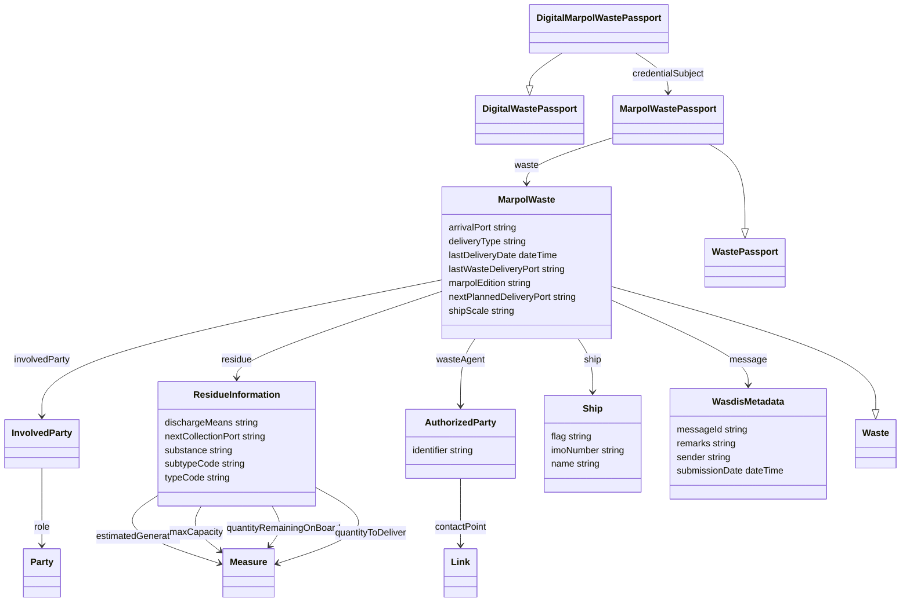

# digitalMarpolWastePassport Ontology

**Version:**  v1.0.0
**Imports:**  https://blue-room-innovation.github.io/bri-ontology/ontology/codelists/delivery-type-code.ttl , https://blue-room-innovation.github.io/bri-ontology/ontology/codelists/discharge-means-code.ttl , https://blue-room-innovation.github.io/bri-ontology/ontology/codelists/iso3166-iAlpha2.ttl , https://blue-room-innovation.github.io/bri-ontology/ontology/codelists/residue-subtype-code.ttl , https://blue-room-innovation.github.io/bri-ontology/ontology/codelists/residue-type-code.ttl , https://blue-room-innovation.github.io/bri-ontology/ontology/codelists/unlocode.ttl
**Link to ontology:**  ontology/digitalMarpolWastePassport.ttl

## Classes

|Name|Description|Datatype properties|Object properties|Subclass of|
| :--- | :--- | :--- | :--- | :--- |
|AuthorizedParty|Represents an authorized entity responsible for handling the waste.|[identifier](#identifier)|[contactPoint](#contactPoint)||
|DigitalMarpolWastePassport|A digital waste passport specific to MARPOL regulations, extending the generic `DigitalWastePassport`.||[credentialSubject](#credentialSubject)|DigitalWastePassport|
|DigitalWastePassport|||||
|InvolvedParty|A party involved in the waste management process, such as the ship operator.||[role](#role)||
|MarpolWaste|Represents a specific waste entity within the MARPOL context, including regulatory attributes for ship-generated waste.|[arrivalPort](#arrivalPort), [deliveryType](#deliveryType), [lastDeliveryDate](#lastDeliveryDate), [lastWasteDeliveryPort](#lastWasteDeliveryPort), [marpolEdition](#marpolEdition), [nextPlannedDeliveryPort](#nextPlannedDeliveryPort), [shipScale](#shipScale)|[involvedParty](#involvedParty), [message](#message), [residue](#residue), [ship](#ship), [wasteAgent](#wasteAgent)|Waste|
|MarpolWastePassport|Represents the waste passport data specific to MARPOL regulations.||[waste](#waste)|WastePassport|
|ResidueInformation|Details of a specific waste residue, including type, quantity, and handling.|[dischargeMeans](#dischargeMeans), [nextCollectionPort](#nextCollectionPort), [substance](#substance), [subtypeCode](#subtypeCode), [typeCode](#typeCode)|[estimatedGenerated](#estimatedGenerated), [maxCapacity](#maxCapacity), [quantityRemainingOnBoard](#quantityRemainingOnBoard), [quantityToDeliver](#quantityToDeliver)||
|Ship|Details about the ship generating the waste.|[flag](#flag), [imoNumber](#imoNumber), [name](#name)|||
|WasdisMetadata|Metadata related to the WASDIS system for auditing purposes.|[messageId](#messageId), [remarks](#remarks), [sender](#sender), [submissionDate](#submissionDate)|||
|Waste|||||
|WastePassport|||||
|Link|||||
|Measure|||||
|Party|||||

## Data Properties

|Name|Description|Domain|Range|Subproperty of|
| :--- | :--- | :--- | :--- | :--- |
|arrivalPort|The port of arrival for the ship, identified using the UN/LOCODE format (e.g., `ESPMI`).|[MarpolWaste](#MarpolWaste)|string||
|deliveryType|Code indicating the type of delivery method used for the waste, based on a local codelist (e.g., `ZTO`).|[MarpolWaste](#MarpolWaste)|string||
|dischargeMeans|The method used to discharge the residue, identified by a local codelist code (e.g., `ZTE`).|[ResidueInformation](#ResidueInformation)|string||
|flag|The flag state of the ship, identified by the ISO 3166-1 Alpha-2 code (e.g., `CY` for Cyprus).|[Ship](#Ship)|string||
|identifier|A unique identifier for the authorized party.|[AuthorizedParty](#AuthorizedParty)|string||
|imoNumber|The International Maritime Organization (IMO) number, a 7-digit identifier for ships.|[Ship](#Ship)|string||
|lastDeliveryDate|The date and time of the last waste delivery, in ISO-8601 format with timezone.|[MarpolWaste](#MarpolWaste)|dateTime||
|lastWasteDeliveryPort|The last port where waste was delivered, using UN/LOCODE format.|[MarpolWaste](#MarpolWaste)|string||
|marpolEdition|The edition of MARPOL applicable to the waste being documented (if relevant).|[MarpolWaste](#MarpolWaste)|string||
|messageId|A unique identifier for the message.|[WasdisMetadata](#WasdisMetadata)|string||
|name|The name of the ship.|[Ship](#Ship)|string||
|nextCollectionPort|The next port where the residue will be collected, identified by the UN/LOCODE|[ResidueInformation](#ResidueInformation)|string||
|nextPlannedDeliveryPort|The next planned port for waste delivery, identified with UN/LOCODE.|[MarpolWaste](#MarpolWaste)|string||
|remarks|Any additional remarks or notes regarding the waste delivery or process.|[WasdisMetadata](#WasdisMetadata)|string||
|sender|The entity that sent the waste notification.|[WasdisMetadata](#WasdisMetadata)|string||
|shipScale|An identifier for the ship scale or port call, useful for traceability.|[MarpolWaste](#MarpolWaste)|string||
|submissionDate|The date and time when the waste notification was submitted.|[WasdisMetadata](#WasdisMetadata)|dateTime||
|substance|The substance of the residue, e.g., oil, sewage, or waste sludge.|[ResidueInformation](#ResidueInformation)|string||
|subtypeCode|Code representing the subtype of residue, providing more detailed categorization.|[ResidueInformation](#ResidueInformation)|string||
|typeCode|Code representing the type of residue, based on a local codelist or MARPOL standard.|[ResidueInformation](#ResidueInformation)|string||

## Object Properties

|Name|Descriptions|Domain|Range|Subproperty of|
| :--- | :--- | :--- | :--- | :--- |
|contactPoint|Contact information for the authorized party, represented as a link.|[AuthorizedParty](#AuthorizedParty)|[Link](#Link)||
|credentialSubject|References the MARPOL-specific waste passport subject (`MarpolWastePassport`).|[DigitalMarpolWastePassport](#DigitalMarpolWastePassport)|[MarpolWastePassport](#MarpolWastePassport)||
|estimatedGenerated|The estimated quantity of residue generated, represented as a measure.|[ResidueInformation](#ResidueInformation)|[Measure](#Measure)||
|involvedParty|The party involved in the waste management process, such as the ship operator or company.|[MarpolWaste](#MarpolWaste)|[InvolvedParty](#InvolvedParty)||
|maxCapacity|The maximum capacity for residue storage, represented as a measure.|[ResidueInformation](#ResidueInformation)|[Measure](#Measure)||
|message|Metadata related to the WASDIS system, including the sender, message ID, and submission details.|[MarpolWaste](#MarpolWaste)|[WasdisMetadata](#WasdisMetadata)||
|quantityRemainingOnBoard|The quantity of residue still remaining onboard, represented as a measure.|[ResidueInformation](#ResidueInformation)|[Measure](#Measure)||
|quantityToDeliver|The quantity of residue to be delivered, represented as a measure.|[ResidueInformation](#ResidueInformation)|[Measure](#Measure)||
|residue|Detailed information about the waste residue, including type, quantity, and discharge method.|[MarpolWaste](#MarpolWaste)|[ResidueInformation](#ResidueInformation)||
|role|The role of the involved party, as defined by the regulatory framework.|[InvolvedParty](#InvolvedParty)|[Party](#Party)||
|ship|Details about the ship responsible for the waste, including the IMO number, name, and flag.|[MarpolWaste](#MarpolWaste)|[Ship](#Ship)||
|waste|Details of the MARPOL-specific waste entity, encapsulating waste-related information within the MARPOL framework.|[MarpolWastePassport](#MarpolWastePassport)|[MarpolWaste](#MarpolWaste)||
|wasteAgent|The authorized waste collection company handling the waste.|[MarpolWaste](#MarpolWaste)|[AuthorizedParty](#AuthorizedParty)||
## Propiedades de Objeto

### contactPoint

**Comentarios:**
- (und) Contact information for the authorized party, represented as a link.
**Domain:** AuthorizedParty
**Range:** Link

### credentialSubject

**Comentarios:**
- (und) References the MARPOL-specific waste passport subject (`MarpolWastePassport`).
**Domain:** DigitalMarpolWastePassport
**Range:** MarpolWastePassport

### estimatedGenerated

**Comentarios:**
- (und) The estimated quantity of residue generated, represented as a measure.
**Domain:** ResidueInformation
**Range:** Measure

### involvedParty

**Comentarios:**
- (und) The party involved in the waste management process, such as the ship operator or company.
**Domain:** MarpolWaste
**Range:** InvolvedParty

### maxCapacity

**Comentarios:**
- (und) The maximum capacity for residue storage, represented as a measure.
**Domain:** ResidueInformation
**Range:** Measure

### message

**Comentarios:**
- (und) Metadata related to the WASDIS system, including the sender, message ID, and submission details.
**Domain:** MarpolWaste
**Range:** WasdisMetadata

### quantityRemainingOnBoard

**Comentarios:**
- (und) The quantity of residue still remaining onboard, represented as a measure.
**Domain:** ResidueInformation
**Range:** Measure

### quantityToDeliver

**Comentarios:**
- (und) The quantity of residue to be delivered, represented as a measure.
**Domain:** ResidueInformation
**Range:** Measure

### residue

**Comentarios:**
- (und) Detailed information about the waste residue, including type, quantity, and discharge method.
**Domain:** MarpolWaste
**Range:** ResidueInformation

### role

**Comentarios:**
- (und) The role of the involved party, as defined by the regulatory framework.
**Domain:** InvolvedParty
**Range:** Party

### ship

**Comentarios:**
- (und) Details about the ship responsible for the waste, including the IMO number, name, and flag.
**Domain:** MarpolWaste
**Range:** Ship

### waste

**Comentarios:**
- (und) Details of the MARPOL-specific waste entity, encapsulating waste-related information within the MARPOL framework.
**Domain:** MarpolWastePassport
**Range:** MarpolWaste

### wasteAgent

**Comentarios:**
- (und) The authorized waste collection company handling the waste.
**Domain:** MarpolWaste
**Range:** AuthorizedParty

## Propiedades de Datos

### arrivalPort

**Comentarios:**
- (und) The port of arrival for the ship, identified using the UN/LOCODE format (e.g., `ESPMI`).
**Domain:** MarpolWaste
**Range:** string

### deliveryType

**Comentarios:**
- (und) Code indicating the type of delivery method used for the waste, based on a local codelist (e.g., `ZTO`).
**Domain:** MarpolWaste
**Range:** string

### dischargeMeans

**Comentarios:**
- (und) The method used to discharge the residue, identified by a local codelist code (e.g., `ZTE`).
**Domain:** ResidueInformation
**Range:** string

### flag

**Comentarios:**
- (und) The flag state of the ship, identified by the ISO 3166-1 Alpha-2 code (e.g., `CY` for Cyprus).
**Domain:** Ship
**Range:** string

### identifier

**Comentarios:**
- (und) A unique identifier for the authorized party.
**Domain:** AuthorizedParty
**Range:** string

### imoNumber

**Comentarios:**
- (und) The International Maritime Organization (IMO) number, a 7-digit identifier for ships.
**Domain:** Ship
**Range:** string

### lastDeliveryDate

**Comentarios:**
- (und) The date and time of the last waste delivery, in ISO-8601 format with timezone.
**Domain:** MarpolWaste
**Range:** dateTime

### lastWasteDeliveryPort

**Comentarios:**
- (und) The last port where waste was delivered, using UN/LOCODE format.
**Domain:** MarpolWaste
**Range:** string

### marpolEdition

**Comentarios:**
- (und) The edition of MARPOL applicable to the waste being documented (if relevant).
**Domain:** MarpolWaste
**Range:** string

### messageId

**Comentarios:**
- (und) A unique identifier for the message.
**Domain:** WasdisMetadata
**Range:** string

### name

**Comentarios:**
- (und) The name of the ship.
**Domain:** Ship
**Range:** string

### nextCollectionPort

**Comentarios:**
- (und) The next port where the residue will be collected, identified by the UN/LOCODE
**Domain:** ResidueInformation
**Range:** string

### nextPlannedDeliveryPort

**Comentarios:**
- (und) The next planned port for waste delivery, identified with UN/LOCODE.
**Domain:** MarpolWaste
**Range:** string

### remarks

**Comentarios:**
- (und) Any additional remarks or notes regarding the waste delivery or process.
**Domain:** WasdisMetadata
**Range:** string

### sender

**Comentarios:**
- (und) The entity that sent the waste notification.
**Domain:** WasdisMetadata
**Range:** string

### shipScale

**Comentarios:**
- (und) An identifier for the ship scale or port call, useful for traceability.
**Domain:** MarpolWaste
**Range:** string

### submissionDate

**Comentarios:**
- (und) The date and time when the waste notification was submitted.
**Domain:** WasdisMetadata
**Range:** dateTime

### substance

**Comentarios:**
- (und) The substance of the residue, e.g., oil, sewage, or waste sludge.
**Domain:** ResidueInformation
**Range:** string

### subtypeCode

**Comentarios:**
- (und) Code representing the subtype of residue, providing more detailed categorization.
**Domain:** ResidueInformation
**Range:** string

### typeCode

**Comentarios:**
- (und) Code representing the type of residue, based on a local codelist or MARPOL standard.
**Domain:** ResidueInformation
**Range:** string

