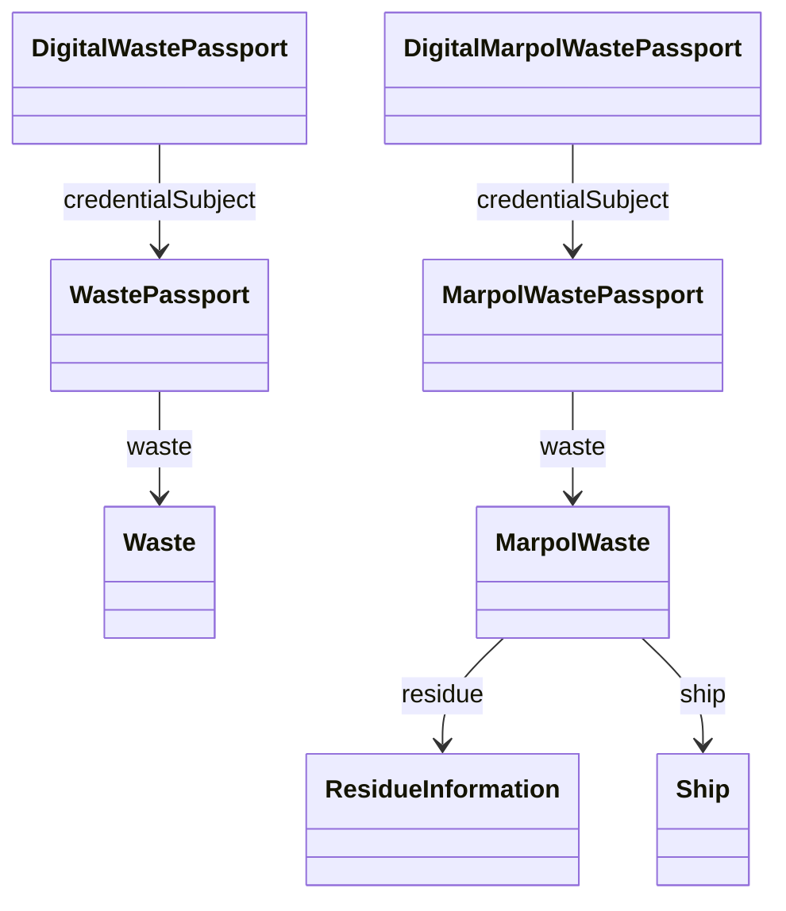

# 1. Introducción y modelo

El Digital Waste Passport (DWP) es una credencial verificable que acompaña a un residuo o lote durante su ciclo de vida (generación → almacenamiento → transporte → tratamiento / entrega). Su variante MARPOL (DMWP) añade requisitos marítimos (buque, puertos, medios de descarga, cantidades embarcadas / entregadas).

Objetivos:
- Trazabilidad y cumplimiento regulatorio (ambiental / MARPOL).
- Transparencia y base para métricas de sostenibilidad.
- Interoperabilidad semántica (alineación selectiva con UNTP / EPCIS).

Capas:
- Núcleo: `DigitalWastePassport`, `WastePassport`, `Waste`.
- Extensión MARPOL: `DigitalMarpolWastePassport`, `MarpolWastePassport`, `MarpolWaste`, `ResidueInformation`, `Ship`.
- Codelists SKOS: tipos/subtipos, medios descarga, tipo entrega, países ISO, puertos UN/LOCODE.
- Shapes SHACL: validan estructura y códigos.

Relaciones mínimas:
`Digital*Passport --credentialSubject--> *WastePassport --waste--> (Waste | MarpolWaste)`.

Propiedades clave iniciales:
- Códigos: `typeCode`, `subtypeCode`, `deliveryType`, `dischargeMeans`.
- Cantidades: `quantityToDeliver`, `quantityRemainingOnBoard`, `estimatedGenerated`.
- Actores (MARPOL): `AuthorizedParty`, `InvolvedParty`.

Diagrama simplificado:

Qué NO es: una plataforma operativa; aquí sólo la capa semántica + tooling de validación.

Siguiente: `02-instalacion-validacion.md`.