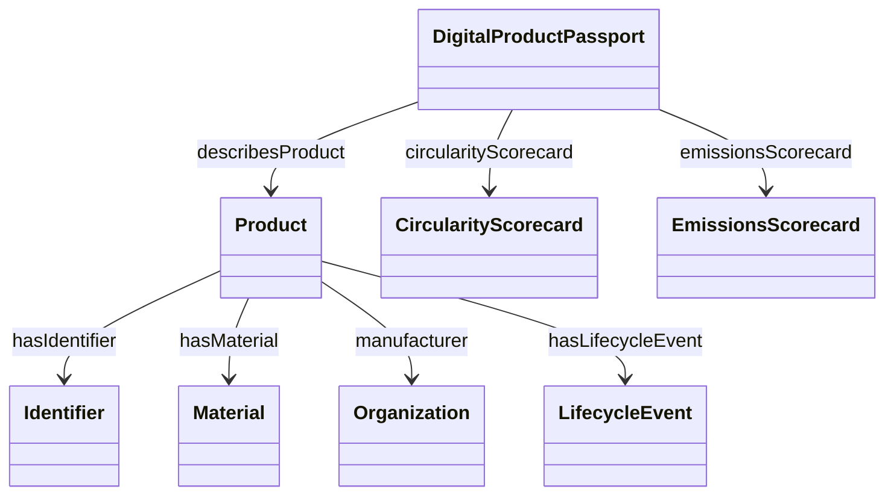

# 5. Modelo de datos (núcleo)

Clases principales: Producto, Pasaporte, Identificador, Material, Organización, Evento de Ciclo de Vida, Documentos, Scorecards, Información de Trazabilidad.

Diagrama (simplificado):

Alineaciones clave (resumen):
- `Product ≡ schema:Product ≡ untpcore:Product`
- `DigitalProductPassport ≡ untpdpp:DigitalProductPassport`
- `Organization ≡ schema:Organization ⊑ untpcore:Party`
- Eventos trazabilidad detallados en `07-alineacion-epcis.md`.

Para módulos y estructura técnica ver `06-modulos-ontologia.md`.
