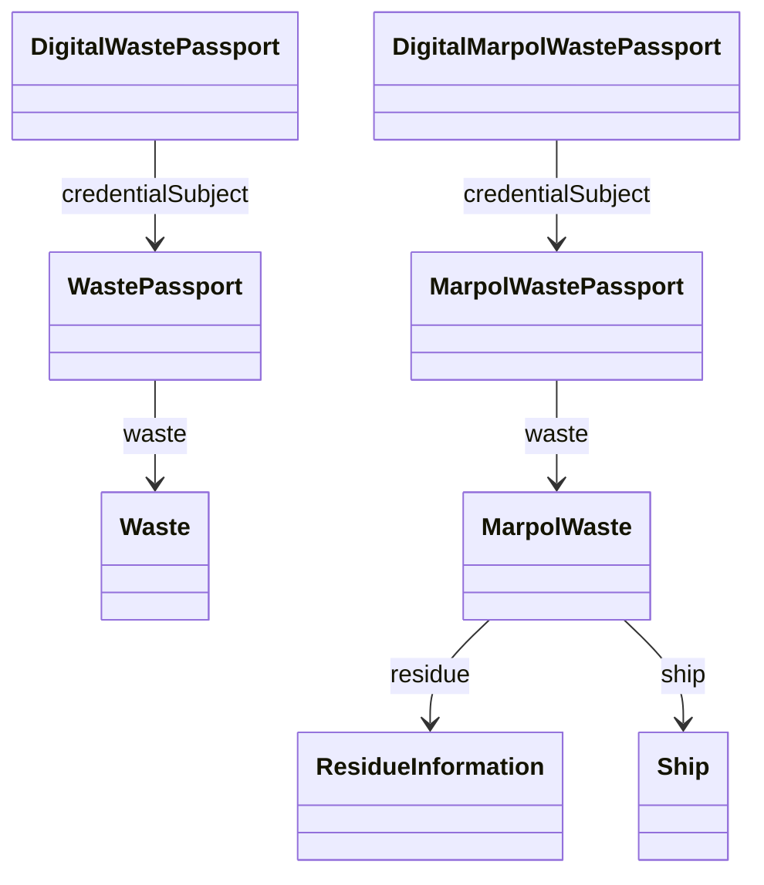

# 5. Modelo de datos (núcleo Waste / MARPOL)

Clases principales núcleo:
- `DigitalWastePassport` (credencial verificada, metadatos de emisión)
- `WastePassport` (credentialSubject: detalle del residuo)
- `Waste` (residuo genérico: origen, clasificación)

Extensión MARPOL:
- `DigitalMarpolWastePassport` / `MarpolWastePassport`
- `MarpolWaste` (residuo marítimo regulado)
- `ResidueInformation` (cantidades y códigos)
- `Ship`, `AuthorizedParty`, `InvolvedParty`

Propiedades clave:
- `credentialSubject` (Digital* → *Passport)
- `waste` (Passport → Waste / MarpolWaste)
- Códigos y medidas: `typeCode`, `subtypeCode`, `deliveryType`, `dischargeMeans`, cantidades (`quantityToDeliver`, `quantityRemainingOnBoard`, `estimatedGenerated`).

Diagrama simplificado:

Alineaciones clave (resumen):
- `DigitalWastePassport ⊑ unece:VerifiableCredential`
- `WastePassport ⊑ unece-dpp:ProductPassport`
- `Waste ⊑ unece:Product`

Para estructura de archivos ver `06-modulos-ontologia.md`.
