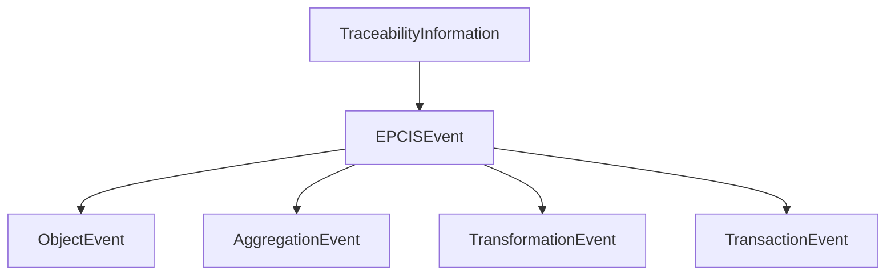

# 7. Alineación EPCIS

Eventos soportados: Object, Aggregation, Transformation, Transaction.

Propiedades clave:
- `eventTime`, `bizStep`, `disposition`, `bizLocation`, `readPoint`, `epc`.

Shape resumen:
- `EPCISEventShape`: tiempo + paso de negocio obligatorio.
- `ObjectEventShape`: exige ≥1 EPC.

Diagrama:

Más en ontología: `ontology/gs1-epcis.ttl`.

UNTP alineaciones en `08-alineacion-untp.md`.
