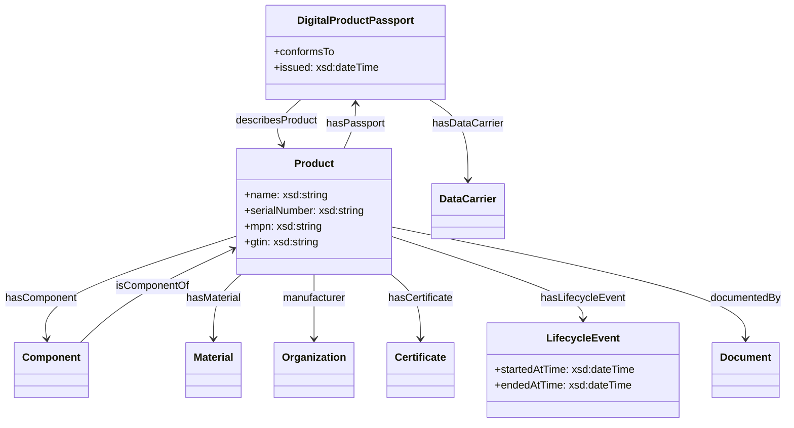

## Ontología DPP (Digital Product Passport)

Este documento resume las principales clases y propiedades de la ontología DPP, con alineaciones a vocabularios establecidos (schema.org, DCTERMS, PROV, ADMS, QUDT). Puedes ver la ontología en `ontology/dpp.ttl`.

### Diagrama (Mermaid)

Nota: se han omitido los prefijos (`dpp:`/`schema:`) en las etiquetas del diagrama para asegurar la compatibilidad del render. Consulta los prefijos completos en los archivos `.ttl`.

### Alineaciones clave

- Clases: `dpp:Product ≡ schema:Product ≡ untpcore:Product`, `dpp:ProductPassport ≡ untpdpp:ProductPassport`, `dpp:Organization ≡ schema:Organization ⊑ untpcore:Party`, `dpp:Person ≡ schema:Person ⊑ untpcore:Party`, `dpp:Location ≡ schema:Place`, `dpp:Facility ≡ untpcore:Facility`, `dpp:MaterialProvenance` (≡ estructura de `untpcore:materialsProvenance`), `dpp:Document ≡ schema:DigitalDocument`, `dpp:LifecycleEvent ⊑ prov:Activity`, `dpp:Identifier ≡ adms:Identifier`.
- Propiedades: `dpp:hasComponent ≡ schema:hasPart`, `dpp:isComponentOf ≡ schema:isPartOf`, `dpp:manufacturer ≡ schema:manufacturer` (ver también `dpp:producedByParty ≡ untpcore:producedByParty`), `dpp:hasIdentifier ≡ adms:identifier`, `dpp:describesProduct ≡ untpcore:product ⊑ schema:about`, `dpp:documentedBy ⊑ dct:documentation`, `dpp:producedAtFacility ≡ untpcore:producedAtFacility`, `dpp:productionDate ≡ untpcore:productionDate`, `dpp:hasMaterialProvenance ≡ untpcore:materialsProvenance`, `dpp:circularityScorecard ≡ untpcore:circularityScorecard`, `dpp:emissionsScorecard ≡ untpcore:emissionsScorecard`; datos: `dpp:serialNumber ≡ schema:serialNumber ≡ untpcore:serialNumber`, `dpp:lotNumber ≡ untpcore:batchNumber`.

### GS1/EPCIS

- Clases: `dpp:EPCISEvent ≡ epcis:Event`, `dpp:ObjectEvent ≡ epcis:ObjectEvent`, `dpp:AggregationEvent ≡ epcis:AggregationEvent`, `dpp:TransformationEvent ≡ epcis:TransformationEvent`, `dpp:TransactionEvent ≡ epcis:TransactionEvent`.
- Propiedades: `dpp:eventTime ≡ epcis:eventTime`, `dpp:recordTime ≡ epcis:recordTime`, `dpp:bizStep ≡ epcis:bizStep` (`cbv:BizStep-*`), `dpp:disposition ≡ epcis:disposition` (`cbv:Disp-*`), `dpp:bizLocation ≡ epcis:bizLocation`, `dpp:readPoint ≡ epcis:readPoint`, `dpp:epc` (lista de EPC, ver `epcis:epcList`).
- Enlace DPP: `dpp:hasEPCISEvent` desde `dpp:TraceabilityInformation` para asociar eventos EPCIS.

### Notas sobre UNTP

- Se incluyen alineaciones explícitas en `ontology/alignments-untp.ttl` y las extensiones en `ontology/dpp-extensions.ttl` utilizando prefijos `untpdpp:` y `untpcore:` (v. 0.x). Para futuras versiones, actualiza los prefijos a la versión estable adecuada.

