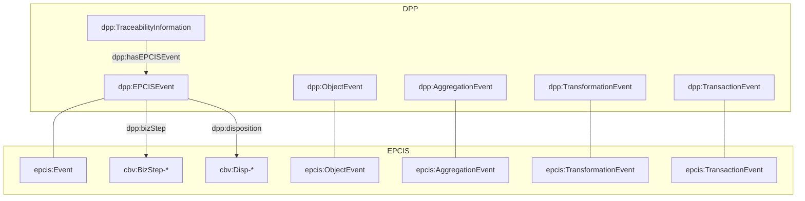

## Integración con GS1 EPCIS

Este módulo conecta `dpp:` con la ontología de eventos de GS1 EPCIS y el Core Business Vocabulary (CBV).

Archivos:
- Ontología: `ontology/gs1-epcis.ttl`
- Shapes: `shapes/dpp-shapes.ttl` (sección EPCIS)

### Diagrama (Mermaid)

### Campos clave
- `dpp:eventTime` (xsd:dateTime) ≡ `epcis:eventTime`
- `dpp:bizStep` (IRI CBV) ≡ `epcis:bizStep`
- `dpp:disposition` (IRI CBV) ≡ `epcis:disposition`
- `dpp:epc` (IRI EPC) → ver `epcis:epcList`
- `dpp:readPoint`, `dpp:bizLocation`
- `dpp:eventTimeZoneOffset` (xsd:string) → `epcis:eventTimeZoneOffset`

### Tipos de eventos soportados
- `dpp:ObjectEvent` (EPCs afectados)
- `dpp:AggregationEvent` (relación padre–hijos EPC)
- `dpp:TransformationEvent` (EPCs de entrada/salida)
- `dpp:TransactionEvent` (transacciones de negocio)

### Shapes (resumen)
- `EPCISEventShape`: valida campos comunes (`eventTime`, `bizStep`, …)
- `ObjectEventShape`: exige 1+ `dpp:epc`
- `AggregationEventShape`: exige 1+ `dpp:childEpc` y opcional `dpp:parentEpc`
- `TransformationEventShape`: exige al menos uno entre `dpp:inputEpc` o `dpp:outputEpc`
- `TransactionEventShape`: exige 1+ `dpp:bizTransaction`

