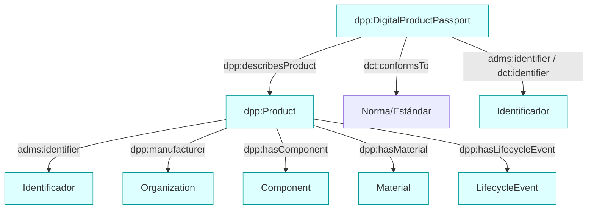

## SHACL Shapes para DPP

Las Shapes validan instancias creadas con la ontología. Archivo: `shapes/dpp-shapes.ttl`.

### Diagrama (Mermaid)

### Reglas principales (resumen)

- `DigitalProductPassport` exige: 1+ `dct:conformsTo`, 1+ `dct:issued`, y al menos una referencia al producto ya sea `dpp:describesProduct` o `untpcore:product`; además, al menos un identificador (`adms:identifier` o `dct:identifier`).
- `Product` exige: `schema:name`, y al menos un identificador entre `adms:identifier`, `untpcore:serialNumber` o `dct:identifier`; fabricante mediante `dpp:manufacturer` o `untpcore:producedByParty`; opcionalmente componentes, materiales y eventos.
- `Identifier` exige al menos uno entre: `dpp:gtin`, `dpp:serialNumber`, `dpp:mpn`.
- `LifecycleEvent` exige: `prov:startedAtTime` y `prov:wasAssociatedWith`.

Extensiones validadas
- `ProductPassport`: permite `dpp:circularityScorecard`, `dpp:emissionsScorecard`, `dpp:traceabilityInformation`, `dpp:conformityClaim`, `dpp:dueDiligenceDeclaration`.
- `Product`: admite `dpp:producedAtFacility`, `dpp:productionDate`, dimensiones/masa mediante `dpp:Measurement` y `dpp:hasMaterialProvenance`.
- `MaterialProvenance`: controla país de origen, tipo de material, fracciones másicas y masa (QUDT).
- `EmissionsScorecard`: exige huella de carbono y unidad declarada (IRI); opcionales alcance operativo, ratio primario y estándar de reporte.
- `CircularityScorecard`: admite indicadores de circularidad (valores decimales).
- `EPCIS`:
  - `EPCISEvent`: requiere `dpp:eventTime` y `dpp:bizStep` (IRI CBV); opcionales `dpp:disposition`, `dpp:bizLocation`, `dpp:readPoint`.
  - `ObjectEvent`: además requiere 1+ `dpp:epc` (IRI EPC).
