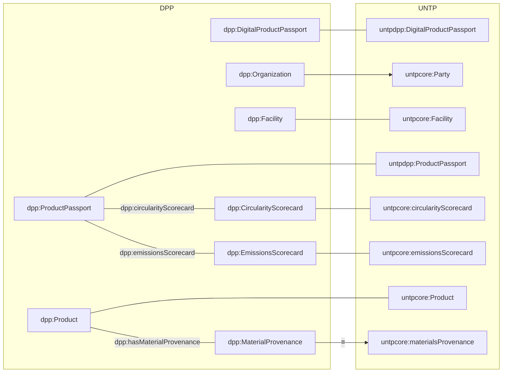

## Alineación DPP ↔ UNTP

Este documento resume las correspondencias clave entre la ontología `dpp:` y los vocabularios UNTP (`untpcore:` y `untpdpp:`). Ver archivos: `ontology/alignments-untp.ttl` y `ontology/dpp-extensions.ttl`.

### Diagrama (Mermaid)

### Correspondencias (resumen)

- Clases: `dpp:ProductPassport ≡ untpdpp:ProductPassport`, `dpp:DigitalProductPassport ≡ untpdpp:DigitalProductPassport`, `dpp:Product ≡ untpcore:Product`, `dpp:Organization ⊑ untpcore:Party`, `dpp:Person ⊑ untpcore:Party`, `dpp:Facility ≡ untpcore:Facility`.
- Propiedades: `dpp:describesProduct ≡ untpcore:product`, `dpp:producedByParty ≡ untpcore:producedByParty`, `dpp:producedAtFacility ≡ untpcore:producedAtFacility`, `dpp:productionDate ≡ untpcore:productionDate`, `dpp:hasMaterialProvenance ≡ untpcore:materialsProvenance`, `dpp:circularityScorecard ≡ untpcore:circularityScorecard`, `dpp:emissionsScorecard ≡ untpcore:emissionsScorecard`.
- Datos: `dpp:serialNumber ≡ untpcore:serialNumber`, `dpp:lotNumber ≡ untpcore:batchNumber`, `dpp:carbonFootprint ≡ untpcore:carbonFootprint`, `dpp:declaredUnit ≡ untpcore:declaredUnit`.

### Ejemplos

- RDF TTL: `examples/product-sample.ttl`
- JSON-LD: `examples/product-sample.jsonld`

