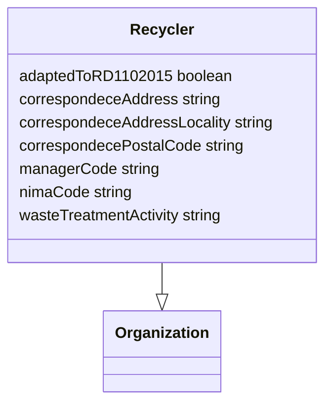

# recycling Ontology

**Link to ontology:**  ontology/v0.1/recycling.ttl

## Classes

|Name|Description|Datatype properties|Object properties|Subclass of|
| :--- | :--- | :--- | :--- | :--- |
|Recycler|An organization that processes waste materials for recycling|[adaptedToRD1102015](#adaptedToRD1102015), [correspondeceAddress](#correspondeceAddress), [correspondeceAddressLocality](#correspondeceAddressLocality), [correspondecePostalCode](#correspondecePostalCode), [managerCode](#managerCode), [nimaCode](#nimaCode), [wasteTreatmentActivity](#wasteTreatmentActivity)||Organization|

## Data Properties

|Name|Description|Domain|Range|Subproperty of|
| :--- | :--- | :--- | :--- | :--- |
|adaptedToRD1102015|Indicates whether the recycler complies with Spanish Royal Decree 110/2015 on WEEE|[Recycler](#Recycler)|boolean|conformance|
|correspondeceAddress|Street address used for postal correspondence when different from the physical address|[Recycler](#Recycler)|string|streetAddress|
|correspondeceAddressLocality|City or locality of the correspondence postal address|[Recycler](#Recycler)|string|addressLocality|
|correspondecePostalCode|Postal code of the correspondence address|[Recycler](#Recycler)|string|postalCode|
|managerCode|Regional waste manager registration code|[Recycler](#Recycler)|string||
|nimaCode|Spanish environmental registration number (NIMA)|[Recycler](#Recycler)|string||
|wasteTreatmentActivity|Free-text description of waste treatment activities|[Recycler](#Recycler)|string||
## Propiedades de Datos

### adaptedToRD1102015

**Labels:**
- (en) Adapted to RD 110/2015 (WEEE)
**Comentarios:**
- (en) Indicates whether the recycler complies with Spanish Royal Decree 110/2015 on WEEE
**Domain:** Recycler
**Range:** boolean

### correspondeceAddress

**Labels:**
- (en) Correspondence street address
**Comentarios:**
- (en) Street address used for postal correspondence when different from the physical address
**Domain:** Recycler
**Range:** string

### correspondeceAddressLocality

**Labels:**
- (en) Correspondence locality
**Comentarios:**
- (en) City or locality of the correspondence postal address
**Domain:** Recycler
**Range:** string

### correspondecePostalCode

**Labels:**
- (en) Correspondence postal code
**Comentarios:**
- (en) Postal code of the correspondence address
**Domain:** Recycler
**Range:** string

### managerCode

**Labels:**
- (en) Waste manager code
**Comentarios:**
- (en) Regional waste manager registration code
**Domain:** Recycler
**Range:** string

### nimaCode

**Labels:**
- (en) NIMA code
**Comentarios:**
- (en) Spanish environmental registration number (NIMA)
**Domain:** Recycler
**Range:** string

### wasteTreatmentActivity

**Labels:**
- (en) Waste treatment activity description
**Comentarios:**
- (en) Free-text description of waste treatment activities
**Domain:** Recycler
**Range:** string

