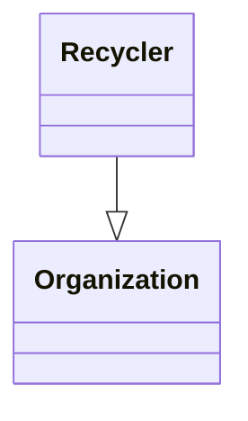

# recycling Ontology

**Link to ontology:**  ontology/v0.1/recycling.ttl

## Classes

|Name|Description|Datatype properties|Object properties|Subclass of|
| :--- | :--- | :--- | :--- | :--- |
|Recycler|An organization that processes waste materials for recycling|||Organization|

## Data Properties

|Name|Description|Domain|Range|Subproperty of|
| :--- | :--- | :--- | :--- | :--- |
|managerCode|Regional waste manager registration code||string||
|nimaCode|Spanish environmental registration number (NIMA)||string||
|wasteTreatmentActivity|Textual description of waste treatment activities||string||

## Object Properties

|Name|Descriptions|Domain|Range|Subproperty of|
| :--- | :--- | :--- | :--- | :--- |
|adaptedToRD1102015|Conformance with Spanish Royal Decree 110/2015 on WEEE|||conformance|
## Propiedades de Objeto

### adaptedToRD1102015

**Labels:**
- (en) Adapted to RD 110/2015 (WEEE)
**Comentarios:**
- (en) Conformance with Spanish Royal Decree 110/2015 on WEEE

## Propiedades de Datos

### managerCode

**Labels:**
- (en) Waste manager code
**Comentarios:**
- (en) Regional waste manager registration code
**Range:** string

### nimaCode

**Labels:**
- (en) NIMA code
**Comentarios:**
- (en) Spanish environmental registration number (NIMA)
**Range:** string

### wasteTreatmentActivity

**Labels:**
- (en) Waste treatment activity description
**Comentarios:**
- (en) Textual description of waste treatment activities
**Range:** string

