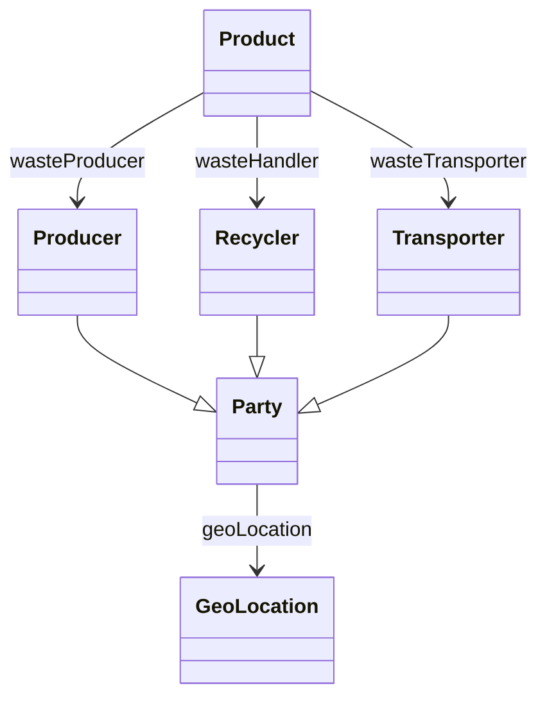

# wasteActors Ontology

**Link to ontology:**  ontology/v0.1/wasteActors.ttl

## Classes

|Name|Description|Datatype properties|Object properties|Subclass of|
| :--- | :--- | :--- | :--- | :--- |
|Producer|The organization that produced or placed the product on the market, and therefore generated the waste.|||Party|
|Recycler|A legally registered organization authorized to manage, treat, recycle or dispose of waste.|||Party|
|Transporter|An organization responsible for transporting waste between locations.|||Party|

## Data Properties

|Name|Description|Domain|Range|Subproperty of|
| :--- | :--- | :--- | :--- | :--- |
|addressLocality||[Party](#Party)|string|addressLocality|
|country||[Party](#Party)|string|addressCountry|
|email||[Party](#Party)|string|email|
|legalName||[Party](#Party)|string|name|
|phone||[Party](#Party)|string|telephone|
|postalCode||[Party](#Party)|string|postalCode|
|registeredId|Official registration identifier such as VAT, company number or national waste registry code.|[Party](#Party)|string||
|streetAddress||[Party](#Party)|string|streetAddress|
|website||[Party](#Party)|anyURI|url|

## Object Properties

|Name|Descriptions|Domain|Range|Subproperty of|
| :--- | :--- | :--- | :--- | :--- |
|geoLocation|Geographic coordinates of the organization.|[Party](#Party)|[GeoLocation](#GeoLocation)||
|wasteHandler|Links a Waste (UNECE Product) to the Recycler responsible for its treatment.|[Product](#Product)|[Recycler](#Recycler)||
|wasteProducer|Links a Waste to the organization that generated it.|[Product](#Product)|[Producer](#Producer)||
|wasteTransporter|Links a Waste to the organization responsible for transporting it.|[Product](#Product)|[Transporter](#Transporter)||
## Propiedades de Objeto

### geoLocation

**Comentarios:**
- (und) Geographic coordinates of the organization.
**Domain:** Party
**Range:** GeoLocation

### wasteHandler

**Comentarios:**
- (und) Links a Waste (UNECE Product) to the Recycler responsible for its treatment.
**Domain:** Product
**Range:** Recycler

### wasteProducer

**Comentarios:**
- (und) Links a Waste to the organization that generated it.
**Domain:** Product
**Range:** Producer

### wasteTransporter

**Comentarios:**
- (und) Links a Waste to the organization responsible for transporting it.
**Domain:** Product
**Range:** Transporter

## Propiedades de Datos

### addressLocality

**Domain:** Party
**Range:** string

### country

**Domain:** Party
**Range:** string

### email

**Domain:** Party
**Range:** string

### legalName

**Domain:** Party
**Range:** string

### phone

**Domain:** Party
**Range:** string

### postalCode

**Domain:** Party
**Range:** string

### registeredId

**Comentarios:**
- (und) Official registration identifier such as VAT, company number or national waste registry code.
**Domain:** Party
**Range:** string

### streetAddress

**Domain:** Party
**Range:** string

### website

**Domain:** Party
**Range:** anyURI

