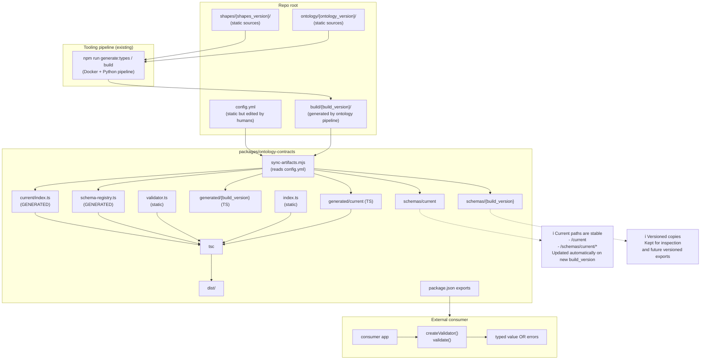

# @blueroominnovation/ontology-contracts

Paquet Node.js/TypeScript (ESM) consumible que publica:

- **JSON Schemas** generats (a partir de SHACL)
- **Tipatges TypeScript** generats
- **Validador AJV** integrat amb `schemaKey` tipat (l'usuari només importa el validador i valida)

Requisits:

- Node.js **>= 20**
- Projecte en mode **ESM** (`"type": "module"`) o TypeScript amb `module: NodeNext`

## Usage

### Instal·lació

```bash
npm i @blueroominnovation/ontology-contracts
```

### Validació (API recomanada)

L'API principal és genèrica i tipada: `validate(data, schemaKey)`.

```ts
import {
  createValidator,
  type SchemaKeyV01,
  type DigitalWastePassport
} from "@blueroominnovation/ontology-contracts";

const validator = createValidator();

const schemaKey: SchemaKeyV01 = "digitalWastePassport";

const payload: unknown = {
  "dct:issued": "2026-01-16T00:00:00Z",
  "dct:publisher": "example-publisher",
  "dwp:credentialSubject": {
    "dwp:waste": {
      "unece:name": "Example waste",
      "unece:productName": "Example product"
    }
  }
};

const result = validator.validate(payload, schemaKey);

if (!result.ok) {
  // Errors normalitzats d'AJV
  console.error(result.errors);
  process.exit(1);
}

// IMPORTANT: el tipus de result.value depèn del schemaKey
const typed: DigitalWastePassport = result.value;
console.log("Issued:", typed["dct:issued"]);
```

### Mode “assert” (excepció si no valida)

Si prefereixes fallar ràpid i obtenir narrowing via TypeScript:

```ts
import { createValidator, type SchemaKeyV01 } from "@blueroominnovation/ontology-contracts";

const validator = createValidator();
const schemaKey: SchemaKeyV01 = "digitalWastePassport";

const payload: unknown = /* ... */;
validator.assertValid(payload, schemaKey);

// A partir d'aquí, payload està tipat segons schemaKey
payload["dct:issued"]; // OK
```

### Injecció d'Ajv (opcional)

Per compartir una mateixa instància Ajv a tota l'app (plugins, opcions, etc.):

```ts
import Ajv from "ajv";
import addFormats from "ajv-formats";
import { createValidator } from "@blueroominnovation/ontology-contracts";

const ajv = new Ajv({ allErrors: true, strict: false, strictSchema: false });
addFormats(ajv);

const validator = createValidator({ ajv });
```

> Nota: `createValidator()` ja crea un Ajv intern amb `ajv-formats`. La injecció és només si vols controlar configuració o compartir Ajv.

### Schemas disponibles (v0.1)

Els `schemaKey` suportats actualment són:

- `"digitalWastePassport"`
- `"digitalMarpolWastePassport"`

Els tipus root que exportem són:

- `DigitalWastePassport`
- `DigitalMARPOLWastePassport`

També pots importar només el “contracte” de versió:

```ts
import type { SchemaKeyV01, DigitalWastePassport } from "@blueroominnovation/ontology-contracts/v0.1";
```

### Recomanat: entrypoint `current`

Per no haver de tocar imports quan canvies `build_version` a `config.yml`, tens un entrypoint estable:

```ts
import type { SchemaKeyCurrent } from "@blueroominnovation/ontology-contracts/current";
```

I schemas a:

- `@blueroominnovation/ontology-contracts/schemas/current/*`

### Accés als JSON Schema (power users)

El paquet publica els fitxers a `./schemas/v0.1/*.schema.json`.

Si el teu runtime suporta JSON modules, els pots importar directament; sinó, fes servir `fs` i `import.meta.url`.

Exemple (Node ESM, lectura via fs):

```ts
import fs from "node:fs";

const url = new URL(
  "../node_modules/@blueroominnovation/ontology-contracts/schemas/v0.1/digitalWastePassport.schema.json",
  import.meta.url
);
const schema = JSON.parse(fs.readFileSync(url, "utf8"));
```

## Development

Des de l'arrel del repo:

- `npm run contracts:build` (sincronitza `build/v0.1/` → paquet i compila TS)
- `npm run contracts:test` (executa l'exemple-consumer com a test d'integració)

L'exemple-consumer és a `examples/consumer-node-ts/`.

### Com s'actualitza quan canvies versions / shapes

La part “packages” **llegeix `config.yml`** i sincronitza automàticament el que hi ha a:

- `build/<build_version>/...` (ex. `build/v0.2/`)

Concretament fa servir `generation.artifacts` per saber quins schemas i quins `.ts` de tipus ha de copiar.
Quan fas `npm run contracts:build`, el script:

1) Copia schemas cap a `schemas/current/` i `schemas/<build_version>/`
2) Copia tipus cap a `src/generated/current/` i `src/generated/<build_version>/`
3) Genera `src/current/index.ts` (schema keys + map de tipus) i `src/schema-registry.ts` (runtime urls)

---

## Flux complet (Mermaid)



### Què toca a mà vs automàtic (resum ràpid)

- **A mà (quan canvies versions o afegeixes contracts):** edites `config.yml` (`build_version` + `generation.artifacts`) i generes `build/<version>` amb el pipeline.
- **Automàtic (cada `contracts:build`):** copia schemas/tipus + regenera `src/current/index.ts` i `src/schema-registry.ts` + compila a `dist/`.
- **Estàtic (normalment no es toca):** `src/validator.ts`, `src/index.ts`, `package.json exports`.
